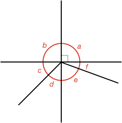

## Quiz

<!-- * Round answers to **two decimal places** -->
* Refresh the page to get new questions

### Question 1:

What would $|q1_angle_num|$ adjacent angles of $|q1_angles|$ be called?

$|div q1_multichoice|$

### Question 2:

* Two lines AC and BE are perpendicular.
* When defining angles, always use the smaller possibility. For example, angle AOB is 90º and not 270º.

Are angles $|q2_angles|$?

$|div q2_multichoice|$

### Question 3:

Using the figure from Question 2, are angles $|q3_angles|$?

$|div q3_multichoice|$

### Question 4:

If angles A, B, and C are complementary, and angle A and B are $|q4_A|$º and $|q4_B|$º respectively, what is the value of C in degrees?

<quiz entryInteger>$|q4_C|$</quiz>

### Question 5:

If angles A, B, and C are supplementary, and angle A and B are $|q5_A|$º and $|q5_B|$º respectively, what is the value of C in degrees?

<quiz entryInteger>$|q5_C|$</quiz>

### Question 6:

If angles A, B, and C are explementary, and angle A and B are $|q6_A|$º and $|q6_B|$º respectively, what is the value of C in degrees?

<quiz entryInteger>$|q6_C|$</quiz>

### Question 7:

If angles a and b are $|q7_A|$º and $|q7_B|$º respectively, what is the value of c in degrees?

<quiz entryInteger>$|q7_C|$</quiz>

### Question 8:

If angles a and b are $|q8_A|$º and $|q8_B|$º respectively, what is the value of c in degrees?

<quiz entryInteger>$|q8_C|$</quiz>

### Question 9:

If angle a is $|q9_a|$º, what is angle b?

<quiz entryInteger>$|q9_b|$</quiz>