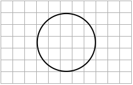
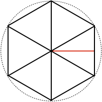
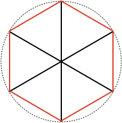
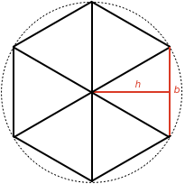

## Area of a Circle

The curves of a circle do not line up with the straight lines of a square, so finding the [[area]]((qr,'Math/Geometry_1/Area/base/Area',#00756F)) of a circle is not necessarily obvious.

Can you find a formula that describes the area of a circle?

<hint>[Hint 1]Try splitting the circle up into triangles</hint>

<hintLow>[Hint 2]
Split the circle into equal pieces, and make the pieces into triangles

The total area of the triangles is a little less than the total area of the circle.
</hintLow>

<hintLow>[Hint 3]
What happens as you increase the number of triangles?

</hintLow>

<hintLow>[Hint 4]
As you increase the number of triangles, how does the triangle $$\definecolor{r}{RGB}{238,34,12}\color{r}height$$ change?

</hintLow>

<hint>[Hint 4 Answer]As you increase the number of triangles, the triangle $$\color{r}height$$ becomes more like the **radius**.</hint>

<hintLow>[Hint 5]
As you increase the number of triangles, how does the outside $$\color{r}border$$ of the triangles change?

</hintLow>

<hint>[Hint 5 Answer]As you increase the number of triangles, the outside $$\color{r}border$$ of the triangles becomes more like the **circumference**.</hint>

<hint>[Hint 6]As you increase the number of triangles, how does the total area of the triangles change?</hint>

<hint>[Hint 6 Answer]As you increase the number of triangles, the total area of the triangles becomes more similar to the area of the circle.</hint>

<hintLow>[Answer]
Split the circle into equal triangles, and then find a formula for the total area of the triangles.

[[Triangle area]]((qr,'Math/Geometry_1/AreaTriangle/base/Main',#00756F)) is half the product of triangle base and height. In this case we have 6 triangles so:

$$Area_{\ triangles} = 6 \times \textstyle{\frac{1}{2}} \times \color{r}h\color{black} \times \color{r}b\color{black}$$

Note $$6\color{r}b$$ is the outside border of the triangles, so the equation can be rearranged for future convenience:

$$ Area_{\ triangles} = \textstyle{\frac{1}{2}} \color{r}h\color{black} \times 6\color{r}b\color{black}$$

Now, what happens when you increase the number of triangles?

* The height becomes more like the radius
* The outside border $$6\color{r}b$$ becomes more like the circumference

Therefore, for $$n$$ triangles where $$n$$ is very very large we can say:

$$\color{r}h\color{black} \approx radius = r$$

$$n\color{r}b\color{black} \approx circumference = 2\pi r$$

Moving these approximations into the original area equation gives

$$ Area_{\ triangles} = \textstyle{\frac{1}{2}} r \times 2\pi r = \pi r^2$$

A more complete description of this process can be seen in this lesson's presentation [Explanation](/Lessons/Math/Geometry_1/AreaCircle/explanation/base) or single page [Explanation](/Lessons/Math/Geometry_1/AreaCircle/explanation/static).
</hintLow>

<!-- 

<hintLow>
Here are several triangles:

[[isosceles]]((qr,'Math/Geometry_1/Isosceles/base/Main',#00756F)) 

[Explanation](/Lessons/Math/Geometry_1/SideAngleRelationship/explanation/base?page=23)

</hintLow>

 -->