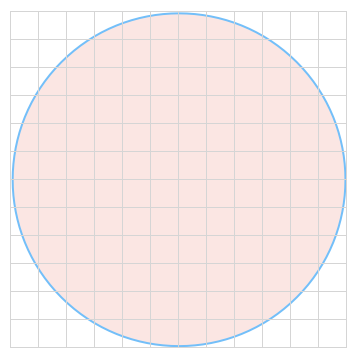
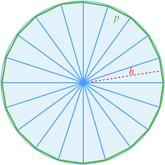
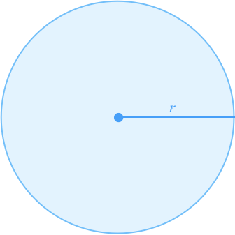

## Area of a Circle

Finding the area of a circle can seem challenging at first as area is measured in squares, and straight square edges don't easily fit into curved circles.

However, we can find the area by making an appoximation of a circle, then refining that approximation.

Lets start by splitting the circle into 6 equal pieces.

Six equal triangles can be formed from the 6 pieces.

These triangles **approximate** a circle. The area of the appoximation is **less** than the area of a circle, but it is a start.

Each triangle is formed from the same angle ($$\definecolor{g}{RGB}{29,177,0}\definecolor{b}{RGB}{0,162,255}\definecolor{r}{RGB}{238,4,12}\definecolor{v}{RGB}{239,95,167}\color{v}60^\circ$$) near the circle center, surrounded by the same side lengths ($$\color{b}r$$). Using the **Side-Angle-Side** congruency test, we know therefore that these triangles are all equal.

Therefore the area of all the triangles is simply six times the area of one triangle. Examining just one triangle:

The area is then:

$$\color{b}{Area_{\ triangle}}\color{black}=\textstyle{\frac{1}{2}}\color{r}h\color{g}b$$

The area of the 6 triangles is then six times the area of one triangle:

$$\color{b}{Area_{\ 6\ triangles}}\color{black}=6\times\textstyle{\frac{1}{2}}\color{r}h\color{g}b$$

Which can be rearranged to:

$$\color{b}{Area_{\ 6\ triangles}}\color{black}=\textstyle{\frac{1}{2}}\color{r}h\color{g}6b\ \ \ \ \ \ \ \ \ \color{grey}(1)$$

Now, looking at the 6 triangles, it can be seen that the perimiter $$\color{g}p$$ is actually 6 times the base of one triangle:

$$\color{g}p=6b\ \ \ \ \ \ \ \ \ \color{grey}(2)$$

We can substitue equation $$\color{grey}(2)$$ into $$\color{grey}(1)$$ to get:

$$\color{b}{Area_{\ 6\ triangles}}\color{black}=\textstyle{\frac{1}{2}}\color{r}h\color{g}p$$

Now, this equation is only dependent on the **height** of the triangles, and the **perimeter** formed by their bases. We could have used any number of triangles, and got the same equation.

For instance, if we had used 20 triangles, the digram would look like:

And the equation would be the same:

$$\color{b}{Area_{\ 20\ triangles}}\color{black}=\textstyle{\frac{1}{2}}\color{r}h\color{g}p\ \ \ \ \ \ \ \ \ \color{grey}(3)$$

Note, the actual values of $$\color{g}p$$ and $$\color{r}h$$ would be different, but the relationship is the same.

Also, we can see that as the number of triangles increases:

* The **area of the triangles** gets closer to the **area of the circle**
* The **height** of the triangles gets closer to the **radius** of the circle: $$\color{r}h\approx r$$
* The **perimeter** of the triangles gets closer to the **circumference** of the circle: $$\color{g}p\approx 2\pi r$$

If we used hundreds or thousands of triangles the difference between these properties would be neglible, so we could rewrite $$\color{grey}(3)$$ as:

$$\color{b}{Area_{circle}}\color{black}=\textstyle{\frac{1}{2}}\color{r}r\color{g}2\pi r$$

Which we can simpilfy to:

$$\color{b}\bbox[20px,border:1px solid red]{Area=\pi r^2}$$

