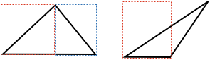

## Area of a Triangle

As [[area]]((qr,'Math/Geometry_1/Area/base/Area',#00756F)) is measured in squares, and triangles and squares don't easily align, it can seem a challenge to calculate the area of a triangle.

However, you can figure it out using just the properties of rectangles and congruent triangles.

Can you figure out what the area of a triangle is?

<hintLow> 
A rectangle can be split into two triangles. These triangles are not general, but if you can calculate the area of them, then they can be applied to more general triangles.

</hintLow>

<hint>Use the properties of a [[rectangle]]((qr,'Math/Geometry_1/RectanglesAndSquares/base/Rectangle',#00756F)), and [[SSS]]((qr,'Math/Geometry_1/CongruentTriangles/base/Sss',#00756F)) to show the triangles in a rectangle are congruent</hint>

<hintLow>
Any triangle can be seen as portions of two rectangles:

</hintLow>

<hintLow>[Answer]

If a line is drawn between opposite vertices of a rectangle, it forms two triangles. This line is called a diagonal.

As opposite sides of a [[rectangle]]((qr,'Math/Geometry_1/RectanglesAndSquares/base/Rectangle',#00756F)) are equal, and both triangles share the same diagonal, then by [[SSS]]((qr,'Math/Geometry_1/CongruentTriangles/base/Sss',#00756F)) the triangles are cogruent.

As they are the same, they have equal area, and so the area of one triangle is half that of the rectangle.

The [[area of a rectangle]]((qr,'Math/Geometry_1/Area/base/Rectangle',#00756F)) is the product of two adjacent sides, so the area of one of the triangles is half that.

Enclose the triangle in two [[parallel lines]]((qr,'Math/Geometry_1/ParallelLines/base/Main',#00756F)), where one is aligned with a side of the triangle, and the other intersects the opposite vertex:

Add three perpendicular lines that go through each vertex of the triangle:

We now have the triangle covering portions of two rectangles, whose sides we can label:

We call the perpendicular line between a triangle point and its opposite side the **height** or **altitude** of a triangle.

Therefore, the area of the triangle is half the areas of the two rectangles.

$$\definecolor{b}{RGB}{0,118,186}\definecolor{r}{RGB}{238,34,12}Area_{\ triangle} = \color{r}Area_{\ rect\ 1} \color{black}+ \color{b}Area_{\ rect\ 2}$$

$$Area_{\ triangle} = \left (\textstyle\frac{1}{2}\times \color{r}h \color{black} \times \color{r}b_1 \color{black} \right ) + \left (\textstyle\frac{1}{2}\times \color{b}h \color{black} \times \color{b}b_2 \color{black} \right )$$

$$Area_{\ triangle} = \textstyle\frac{1}{2} \times h \times \left( \color{r}b_1 \color{black} + \color{b}b_2 \color{black} \right ) $$

The base side of the triangle is $$\color{r}b_1 \color{black} + \color{b}b_2$$, thus:

$$Area_{\ triangle} = \textstyle\frac{1}{2} \times h \times base $$

So the area of a triangle is half the product of its base and height.

Any side can be chosen as the base, and this lesson's [Explanation](/Lessons/Math/Geometry_1/AreaTriangle/explanation/base?page=37) shows the example where triangle's top point does not sit directly above the base.

</hintLow>