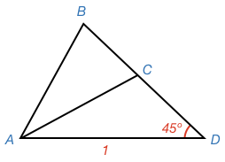
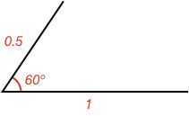

## Congruent Triangles

In mathematics, if **two shapes are the same size and shape**, then they are said to be **congruent**.

The word **congruent** comes from _Latin_, where it means _"agreeing, meeting together"_.

For two triangles to be **congruent**, the corresponding **side lengths** and **angles** of each triangle must be the same as the other.

Flipped and rotated triangles can still have the same corresponding sides and angles and therefore be congruent.

## Congruency Tests

The easy way to determine if two triangles are congruent is to measure all their sides and angles.

But is there a faster way? What is the number of sides and/or angles you need to know to determine if two triangles are congruent?

### One Property

If you just know a single side or angle, is that enough to know whether two triangles are congruent?

<hintLow>

Another way to ask this is: if you fix one side (or angle), how many different triangles can you make?

If the answer is just one, then you know if two triangles have one side that is the same length then they will be congruent.

</hintLow>

<hint>Try drawing a side - how can you build more than one triangle off that side?</hint>

<hint>Try drawing an angle - how can you build more than one triangle off that angle?</hint>

<hintLow>[Answer]

If you start with just a single side, you can make more than one triangle. For example:

If you know one side (in this case of value 1), then triangles ABC and ABD can be built off that side.

If you start with just a single angle, you can also make more than one triangle.

If you know one angle (60º), then triangles ABE and ACD can be formed from it.

In fact, any number of triangles can be formed from either a single side or single angle.

</hintLow>

### Two Properties

What about if you know two properties? What are the different combinations of properties you might know? One combination is two sides, what are the others?

<hintLow>[Answer] The combinations are 

* two sides
* two angles
* one side and one angle

</hintLow>

Are any of these combinations suffient to determine if two triangles are congruent?

<hintLow>Try drawing a side and an angle - can more than one triangle be built? </hintLow>

<hintLow>Try drawing two angles - can more than one triangle be built? What if you change their separation? </hintLow>

<hint>When drawing two sides, remember the angle between them can be any angle</hint>

<hintLow>[Answer] Many triangles can be made if you start with just **two properties**. Therefore, two properties are not sufficient to tell whether two triangles are congruent.

Knowing just a **side-angle** combination is not enough:

In this example, triangles ACD and ABD both share the same side and angle.

Knowing just an **angle-angle** combination is not enough:

In this example, triangles ACD and ABE both share a 60º and 45º angle but are different sizes.

Knowing just a **side-side** combination is not enough:

In this example, triangles ABD or ACD both have sides of value 1 and 1.2. In fact, the side of value 1 can be anywhere on the circle around D, forming many different triangles.

</hintLow>

### Three Properties

What about if you know three properties? What are the different combinations of properties you might know? One combination is three sides, what are the others?

<hintLow>[Answer] There are six combinations. Combinations are typlically denoted **property-property-property** where order is how they appear in the triangle.

For example, if you have two angles and a side, it could either be **side-side-angle** or **side-angle-side**. The **side-angle-side** combination would consist of an angle between two sides like:

whereas **side-side-angle** would be an angle adjacent to just one of the sides:

The six combinations are:

* side-side-side
* angle-angle-angle
* side-side-angle
* side-angle-side
* angle-angle-side
* angle-side-angle

</hintLow>

Are any of these combinations suffient to determine if two triangles are congruent?

<hint>Start with **side-angle-side** or **angle-side-angle**.
</hint>

<hintLow>For **side-angle-side**, how many triangles can be constructed once you start with:

</hintLow>

<hintLow>For **angle-side-angle**, how many triangles can be constructed once you start with:

</hintLow>

<hint>For **angle-angle-side**, use the total angle of a [[triangle]]((qr,'Math/Geometry_1/Triangles/base/AngleSumPres',#00756F)) to get to the **angle-side-angle** case.
</hint>

