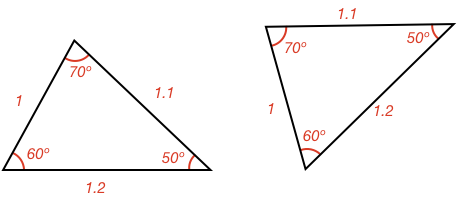
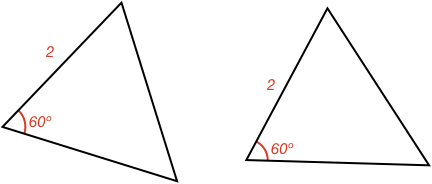
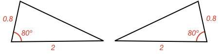
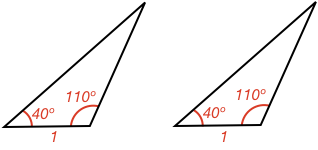
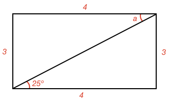

## External Angles of a Triangle Calculations

### Example 1:

#### Are these two triangles congrunet?

Both triangles have the same corresponding angles and side lengths. Therefore, they are the same and congruent.

$$\bbox[10px,border:1px solid gray]{Yes}$$

### Example 2:

#### Are these two triangles congrunet?

Both triangles have the same corresponding angle and side, however two properties is not enough information to guarantee the triangles are congruent.

$$\bbox[10px,border:1px solid gray]{Not\ \ enough\ \ information}$$

### Example 3:

#### Are these two triangles congrunet?

Both triangles have the same corresponding **side-angle-side** combination. Even though they are mirror images of each other (flipped), they will have all the same corresponding angles and sides and so they are congruent.

$$\bbox[10px,border:1px solid gray]{Yes}$$

### Example 4:

#### Are these two triangles congrunet?

Both triangles have the same corresponding **angle-side-angle** combination. Therefore they are congruent.

$$\bbox[10px,border:1px solid gray]{Yes}$$

### Example 5:

#### Are these two triangles congrunet?

As presented, the triangles have two different sets of properties. The left has **angle-side-angle** while the one on the right is **angle-angle-side**.

However, we also know the sum of angles in a [[triangle]]((qr,'Math/Geometry_1/Triangles/base/AngleSumPres',#00756F)) is 180º. Therefore, we can calculate the unknown angle in both triangles, and we will have four known properties in each triangle.

The unknown angle is the same for both triangles:

$$180^\circ - 75^\circ - 30^\circ = 75^\circ$$

We now have the same **angle-side-angle** property combination in both triangles and they are therefore congruent. (Note, we also have the same **angle-angle-side** combination in both triangles).

$$\bbox[10px,border:1px solid gray]{Yes}$$

### Example 6:

#### What is the size of angle $$\definecolor{r}{RGB}{238,34,12}\color{r}a$$ in degrees?

Even though one of the triangles sides (the middle diagonal) doesn't have a length, both triangles share it as a side.

Therefore, we know both triangles share all the same side lengths and are congruent. As they are congruent, we know that the corresponding angles must also be the same.

In the top triangle, angle $$\definecolor{r}{RGB}{238,34,12}\color{r}a$$ is opposite the side with length 3. On the bottom triangle, the side with length 3 is opposite the angle 25º.

Therefore:

$$\color{r}a \color{black} = \bbox[10px,border:1px solid gray]{25^\circ}$$

