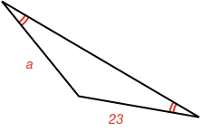
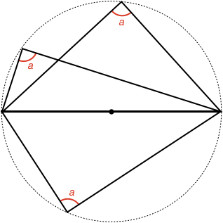

## Isosceles Triangle Calculation Examples

### Example 1:

#### What is the size of angle $$\definecolor{r}{RGB}{238,34,12}\color{r}a$$ in degrees?

<hintLow>[Answer]
The shape is an isosceles triangle, and therefore the angles opposite the equal sides are equal. As we know the angles in a [[triangle]]((qr,'Math/Geometry_1/Triangles/base/AngleSum',#00756F)) add to 180º, then:

$$180^\circ = \color{r}a \color{black} + \color{r}a \color{black} + 95^\circ$$

$$\color{r}a \color{black}= \bbox[10px,border:1px solid gray]{42.5^\circ}$$
</hintLow>

### Example 2:

#### What is the length of side $$\color{r}a$$?

<hintLow>[Answer]
The triangle has two equal angles, and is therefore an isosceles triangle. As such, the sides opposite the equal angles will be equal in length. Therefore:

$$\color{r}a \color{black}= \bbox[10px,border:1px solid gray]{23}$$
</hintLow>

### Example 3:

#### A square is split with a line between opposite corners. What is angle $$\color{r}a$$ in degrees?

<hintLow>[Answer]
A [[square's]]((qr,'Math/Geometry_1/RectanglesAndSquares/base/Square',#00756F)) sides are all equal, therefore the triangles that form the split square are isosceles triangles.

We also know the square corner angle is 90º, and so therefore the angle $$\color{r}a$$ is:

$$\color{r}a \color{black} = \frac{180^\circ - 90^\circ}{2} = \bbox[10px,border:1px solid gray]{45^\circ}$$
</hintLow>

### Example 4:

#### Show that any triangle made from the diameter of a circle and a point on the circle has the same angle $$\color{r}a$$?

<hintLow>[Answer]

We can use isosceles triangles to solve this problem. Start by considering just one triangle and drawing a line from the point at angle $$\color{r}a$$ to the center of the circle:

As the circle's radius is a constant length, we have effectively created two isosceles triangles. Each triangle has equal angles $$\definecolor{g}{RGB}{29,177,0}\definecolor{b}{RGB}{0,118,186}\color{b}b$$ and $$\color{g}c$$.

Now sum the original triangle's angles:

$$\color{b}b \color{black}+ \color{b}b \color{black}+ \color{g}c \color{black}+ \color{g}c \color{black} = 180^\circ$$

$$2\left (\color{b}b \color{black}+ \color{g}c \color{black}\right ) = 180^\circ$$

$$\color{b}b \color{black}+ \color{g}c \color{black}= 90^\circ$$

This answer does not depend on the actual values of $$\color{b}b$$ and $$\color{g}c$$, as it says they will always sum to the same angle.

Therefore, all triangles that have one side as the diameter of the circle, and the other two sides meet at a point on the circle will have an angle opposite the diameter of:

$$\bbox[10px,border:1px solid gray]{90^\circ}$$

</hintLow>
