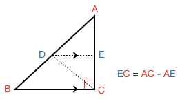
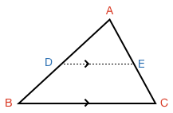
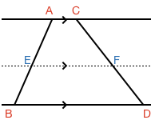

## Parallel Split of a Triangle

### Right Angle Triangle

Take a right angle triangle $$\definecolor{g}{RGB}{29,177,0}\definecolor{gr}{RGB}{100,100,100}\definecolor{r}{RGB}{238,34,12}\color{r}ABC$$ and draw a line $$\definecolor{b}{RGB}{0,118,186}\color{b}DE$$ parallel to one of its sides such that it splits the triangle:

Can you show the sides of the smaller triangle are all in the same proportion to the sides of the larger triangle? In other words, can you show:

$$\frac{\color{r}A\color{b}D}{\color{r}AB} = \frac{\color{r}A\color{b}E}{\color{r}AC} = \frac{\color{b}DE}{\color{r}BC}$$

<hint>[Hint 1]Split the triangle up into more triangles, and use [[triangle area]]((qr,'Math/Geometry_1/AreaTriangle/base/Main',#00756F)) and the [[Pythagorean theorem]]((qr,'Math/Geometry_1/RightAngleTriangles/base/Pythagorus',#00756F)) to find relationships between the sides</hint>

<hintLow>[Hint 2]

</hintLow>

<hintLow>[Answer]

First we can find a relationship between two sides by finding the area of the large triangle

$$\triangle \color{r}ABC_{\color{black}area} \color{black}= \triangle \color{r}A\color{b}DE_{\color{black}area} \color{black}+ \triangle \color{r}B\color{b}D\color{r}C_{\color{black}area} \color{black}+ \triangle \color{b}D\color{r}C\color{b}E_{\color{black}area}$$

[[Area of a triangle]]((qr,'Math/Geometry_1/AreaTriangle/base/Main',#00756F)) is half the product of base and height. Therefore:

$$\textstyle{\frac{1}{2}}\color{r}\ BC\  AC \color{black}= \textstyle{\frac{1}{2}}\  \color{b}DE\  \color{r}A\color{b}E \color{black}+ \textstyle{\frac{1}{2}}\ \color{b}DE\  \color{b}E\color{r}C \color{black}+ \textstyle{\frac{1}{2}}\ \color{r}BC\  \color{b}E\color{r}C$$

Substituting in $$\color{b}E\color{r}C \color{black}= \color{r}AC \color{black}- \color{r}A\color{b}E$$ and simplifying down results in:

$$\frac{\color{r}A\color{b}E}{\color{r}AC}=\frac{\color{b}DE}{\color{r}BC}\color{black}\ \ \ \ \ \ \ \color{gr}(1)$$

Now, the Pythagorean theroem allows us to get expressions for $$\color{r}AB$$ and $$\color{r}A\color{b}D$$:

$$\color{r}AB^{\color{black}2} \color{black}= \color{r}BC^{\color{black}2} \color{black}+ \color{r}AC^{\color{black}2}\ \ \ \ \ \ \ \color{gr}(2)$$

$$\color{r}A\color{b}D^{\color{black}2} \color{black}= \color{b}DE^{\color{black}2} \color{black}+ \color{r}A\color{b}E^{\color{black}2}\ \ \ \ \ \ \ \color{gr}(3)$$

We know from $$\color{gr}(1)$$ that:

$$\color{b}DE \color{black}= \color{r}BC\color{black}\frac{\color{r}A\color{b}E}{\color{r}AC}\ \ \ \ \ \ \ \color{gr}(4)$$

$$\color{r}A\color{b}E \color{black}= \color{r}AC\color{black}\frac{\color{b}DE}{\color{r}BC}\color{black}= \color{r}AC\color{black}\frac{\color{r}A\color{b}E}{\color{r}AC}\ \ \ \ \ \ \ \color{gr}(5)$$

Substituting $$(\color{gr}4)$$ and $$(\color{gr}5)$$ into $$(\color{gr}3)$$ then gives:

$$\color{r}A\color{b}D^{\color{black}2} \color{black}= \color{r}BC^{\color{black}2}\color{black}\frac{\color{r}A\color{b}E^{\color{black}2}}{\color{r}AC^{\color{black}2}} \color{black}+ \color{r}AC^{\color{black}2}\color{black}\frac{\color{r}A\color{b}E^{\color{black}2}}{\color{r}AC^{\color{black}2}} \color{black}= \frac{\color{r}A\color{b}E^{\color{black}2}}{\color{r}AC^2}\color{black}\left(\color{r}BC^{\color{black}2} \color{black}+ \color{r}AC^{\color{black}2}\color{black}\right)$$

Which we can then divide by $$\color{gr}(2)$$ to get:

$$\frac{\color{r}A\color{b}D}{\color{r}AB} \color{black}= \frac{\color{r}A\color{b}E}{\color{r}AC}$$

And so all sides of the smaller triangle have the same proportion to the larger triangle.

This is described in more detail (with all equation steps) in this lesson's [Explanation](/Lessons/Math/Geometry_1/ParallelSplitOfTriangle/explanation/base?page=1).

</hintLow>

### Any Triangle

Can you use the learnings from the right angle triangle to show the same relationship holds for any triangle?

$$\frac{\color{r}A\color{b}D}{\color{r}AB} = \frac{\color{r}A\color{b}E}{\color{r}AC} = \frac{\color{b}DE}{\color{r}BC}$$

<hint>Split the triangle into two right angle triangles</hint>

<hintLow>[Answer]

Split the triangle into two right angle triangles:

For right angle triangles we proved the smaller triangle is always proportional to the larger. Also, as both triangles share the same side $$\color{r}A\color{g}G$$ we get:

$$\frac{\color{r}A\color{b}D}{\color{r}AB} \color{black}= \frac{\color{r}A\color{g}F}{\color{r}A\color{g}G}$$

$$\frac{\color{r}A\color{b}E}{\color{r}AC} \color{black}= \frac{\color{r}A\color{g}F}{\color{r}A\color{g}G}$$

So then:

$$\frac{\color{r}A\color{b}D}{\color{r}AB} \color{black}= \frac{\color{r}A\color{b}E}{\color{r}AC}$$

Then for the base:

$$\frac{\color{b}D\color{g}F}{\color{r}B\color{g}G} \color{black}= \frac{\color{r}A\color{g}F}{\color{r}A\color{g}G}\ \ \ \ \ \ \ \color{gr}(6)$$

$$\frac{\color{g}F\color{b}E}{\color{g}G\color{r}C} \color{black}= \frac{\color{r}A\color{g}F}{\color{r}A\color{g}G}\ \ \ \ \ \ \ \color{gr}(7)$$

We also know:

$$\color{b}DE \color{black}= \color{b}D\color{g}F \color{black}+ \color{g}F\color{b}E\ \ \ \ \ \ \ \color{gr}(8)$$

Substituting $$\color{gr}(6)$$ and $$\color{gr}(7)$$ into $$\color{gr}(8)$$:

$$\color{b}DE \color{black}= \frac{\color{r}A\color{g}F}{\color{r}A\color{g}G}\color{black}\left(\color{r}B\color{g}G \color{black}+ \color{g}G\color{r}C\color{black}\right)$$

As $$\color{r}B\color{g}G \color{black}+ \color{g}G\color{r}C \color{black}= \color{r}BC$$ then we have:

$$\color{b}DE \color{black}= \frac{\color{r}A\color{g}F}{\color{r}A\color{g}G}\color{r}BC$$

$$\frac{\color{b}DE}{\color{r}BC} \color{black}= \frac{\color{r}A\color{g}F}{\color{r}A\color{g}G} = \frac{\color{r}A\color{b}D}{\color{r}AB} = \frac{\color{r}A\color{b}E}{\color{r}AC}$$

This is described in more detail (with all equation steps) [Explanation](/Lessons/Math/Geometry_1/ParallelSplitOfTriangle/explanation/base?page=37).

The case where a triangle is formed by the difference of right angle triangles is discussed in the single page version of the [Explanation](/Lessons/Math/Geometry_1/ParallelSplitOfTriangle/explanation/static).

</hintLow>

### Lines between Parallel Lines

Consider the case where there are lines between two parallel lines. If a third parallel line is introduced that splits the lines, can you show that all lines are split in proportion?

$$\frac{\color{r}A\color{b}E}{\color{r}AB} \color{black}= \frac{\color{r}C\color{b}F}{\color{r}CD}$$

<hint>Once again, the right angle triangle relationship above can be used</hint>

<hintLow>[Answer]

Each line between the parallel lines can be considered the hypotenuse of a right angle triangle:

As the [[distance]]((qr,'Math/Geometry_1/ParallelLineDistance/base/Main',#00756F)) between parallel lines is the constant perpendicular line between them, then all triangles share the same side length.

$$\color{r}A\color{g}G \color{black}= \color{r}C\color{g}H$$

The third parallel line is also a constant distance, and thus splits $$\color{r}A\color{g}G$$ and $$\color{r}C\color{g}H$$ in the same proportion.

As both triangles have a side split in the same proportion, then all sides must be split in the same proportion and therefore $$\color{r}AB$$ and $$\color{r}CD$$ are split in the same proportion.

</hintLow>