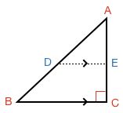

## Parallel Split of a Triangle

### Right Angle Triangle

Take a right angle triangle $$\definecolor{r}{RGB}{238,34,12}\color{r}ABC$$ and draw a line $$\definecolor{b}{RGB}{0,118,186}\color{b}DE$$ parallel to one of its sides:

Can you show the sides of the smaller triangle are all in the same proportion to the sides of the larger triangle? In other words, can you show:

$$\frac{\color{r}A\color{b}D}{\color{r}AB} = \frac{\color{r}A\color{b}E}{\color{r}AC} = \frac{\color{b}DE}{\color{r}BC}$$

<hint>[Hint 1]Split the triangle up into more triangles, and use [[triangle area]]((qr,'Math/Geometry_1/AreaTriangle/base/Main',#00756F)) and the [[Pythagorean theorem]]((qr,'Math/Geometry_1/RightAngleTriangles/base/Pythagorus',#00756F)) to find relationships between the sides</hint>

<!-- The [[distance]]((qr,'Math/Geometry_1/PointLineDistance/base/Main',#00756F)) between a point and a line is the shorter of:

* the distance between the point and the line's end
* the distance of a line drawn between the point and the line that is perpendicular to the line

Given this, what properties can you find about the distance between parallel lines?

<hint>[Hint 1]First think about the distance between a point on one line and the other line</hint>

<hint>[Hint 2]Is the line representing the shortest distance between lines also perpendicular?</hint>

<hint>[Hint 3]Does the distance between parallel lines change? Why?</hint>

<hint>[Hint 4]The concept of [[interior angles]]((qr,'Math/Geometry_1/AnglesAtIntersections/base/Interior',#00756F)) and properties of a [[rectangle]]((qr,'Math/Geometry_1/RectanglesAndSquares/base/Rectangle',#00756F)) can be helpful to show how distance changes between parallel lines</hint>

<hintLow>[Answer]
If we select a random point along one of the lines, we know the [[distance]]((qr,'Math/Geometry_1/PointLineDistance/base/Main',#00756F)) line between it and the second line will be perpendicular to the second line.

We can use [[interior angles]]((qr,'Math/Geometry_1/AnglesAtIntersections/base/Interior',#00756F)) and the properties of a [[rectangle]]((qr,'Math/Geometry_1/RectanglesAndSquares/base/Rectangle',#00756F)) to realize that the distance line is also perpendicular to the first line.

If we select a second random point on the first line and draw a second distance line we get:

The four lines create a shape that has four right angles, and is therefore a rectangle. [[Rectangles]]((qr,'Math/Geometry_1/RectanglesAndSquares/base/Rectangle',#00756F)) have the property that opposite sides are parallel and **equal**. Therefore, the distance lines are equal in length.

We could do this same exersise for any point along the first line, so all distance lines must be the **same length**.

Thus, the distance between parallel lines is the **length of a perpendicular line between them**, and is **constant** anywhere along the lines.

A more interactive version of this can be found in this lesson's [Explanation](/Lessons/Math/Geometry_1/ParallelLineDistance/explanation/base?page=1).

</hintLow>
 -->