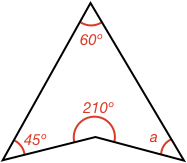

## External Angles of a Triangle Calculations

### Example 1:

#### What is the size of angle $$\definecolor{r}{RGB}{238,34,12}\color{r}a$$ in degrees?

A quadrangle's internal angles all add to 360º. Therefore:

$$\color{r}a \color{black} = 360^\circ - 45^\circ - 210^\circ - 60^\circ$$

$$\color{r}a \color{black} = \bbox[10px,border:1px solid gray]{45^\circ}$$
