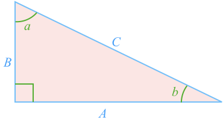

## Pythagorean Theorm Proof

Start with a **Right Angled Triangle** that has side lengths $$\definecolor{lessonBlue}{RGB}{0,162,255}\definecolor{lessonGreen}{RGB}{29,177,0}\color{lessonBlue}A$$, $$\color{lessonBlue}{B}$$, and $$\color{lessonBlue}{C}$$, and angles $$\color{lessonGreen}{a}$$, $$\color{lessonGreen}{b}$$ and $$\color{lessonGreen}{90^\circ}$$:

Make a rotated copy of the triangle, join: 

At the join, the angles $$b$$, $$e$$ and $$a$$ are **supplementary**.
