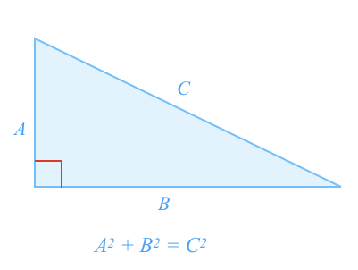

The **Pythagorean Theorem** relates the **side lengths** of a right angle triangle.

For any right angle triangle, the **square** of the **hypotenuse** length is equal to the **sum of the squares** of the remaining **two side** lengths.