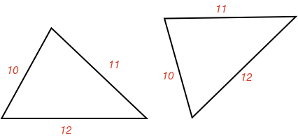
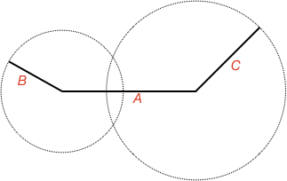
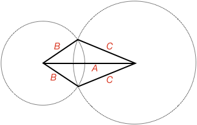

## Side Side Side Triangle Congruence

If two triangles have the same side lengths, do they also have the same angles and are therefore congruent? Why?

<hint>If only one triangle can be formed from the initial constraints (in this case three side lengths) then any two triangles with the same side lengths will be the same triangle (congruent)</hint>

<hintLow>Start with a fixed side, then draw all possible locations a second fixed length side could go.

In this case, we draw a side with length A. Then a circle with radius B represents all the locations a second side with length B could go.

Now do the same for the second side.
</hintLow>

<hintLow>

What locations can B and C go to form triangles?

</hintLow>

<hintLow>

Two triangles are possible:

Are they congruent?

</hintLow>

<hint>Make two isosceles triangles</hint>

<hint>Solve the angles</hint>

<hint>Use [[SAS]]((qr,'Math/Geometry_1/CongruentTriangles/base/Sas',#00A89D)) test for congruence</hint>

<hintLow>[Answer]

Only one triangle can be made from three fixed side lengths.

Therefore, if two triangles share the same side lengths they will have the same angles and be congruent.

This lesson's [Explanation](/Lessons/Math/Geometry_1/SideSideSide/explanation/base?page=3) details why three side lengths form just one triangle.
</hintLow>
