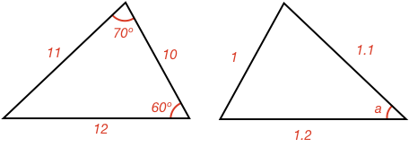

## Side Angle Relationship Examples

### Example 1:

#### What is the size of angle $$\definecolor{r}{RGB}{238,34,12}\color{r}a$$ in degrees?

Both triangles have the same side lengths, and are therefore congruent.

The left triangle's missing angle corresponds with angle $$\color{r}a$$, and can be calculated knowing the sum of angles in a [[triangle]]((qr,'Math/Geometry_1/Triangles/base/AngleSum',#00756F)) is 180º. Therefore

$$\color{r}a \color{black} = 180^\circ - 70^\circ - 60^\circ = \bbox[10px,border:1px solid gray]{50^\circ}$$

### Example 2:

#### Are the two triangles congruent?

The larger shape is a [[rectangle]]((qr,'Math/Geometry_1/RectanglesAndSquares/base/Rectangle',#00756F)) as it has four 90º angles.

Therefore, its opposite sides are equal in length.

The two triangles share a longer side in the middle of the rectangle, and so both have the same side lengths. Therefore, they are congruent.

$$\definecolor{r}{RGB}{238,34,12}\bbox[10px,border:1px solid gray]{Yes}$$

### Example 3:

#### What is the size of angle $$\definecolor{r}{RGB}{238,34,12}\color{r}a$$ in degrees?

Even though one of the triangles sides (the middle diagonal) doesn't have a length, both triangles share it as a side.

Therefore, we know both triangles share all the same side lengths and are congruent. As they are congruent, we know that the corresponding angles must also be the same.

In the top triangle, angle $$\definecolor{r}{RGB}{238,34,12}\color{r}a$$ is opposite the side with length 3. On the bottom triangle, the side with length 3 is opposite the angle 25º.

Therefore:

$$\color{r}a \color{black} = \bbox[10px,border:1px solid gray]{25^\circ}$$