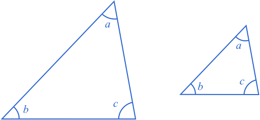
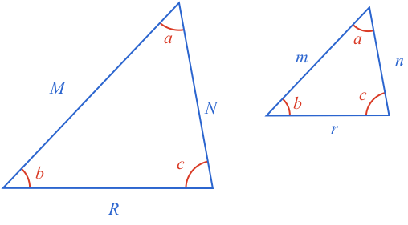

## Similar Triangles

Similar shapes are those that have the same shape but are a different size.

Similar triangles are triangles that have the same angles, and whose corresponding sides are proportional.

### Equiangular Triangles are Similar - Proof

Two triangles that have the same angles can be different sizes.

However, while the sizes may be different, the sizes are still related. Specifically, all pair of corresponding sides have the same ratio.

This means, if the side of the larger triangle between angles $$\definecolor{b}{RGB}{0,103,214}\definecolor{g}{RGB}{29,177,0}\definecolor{g}{RGB}{238,34,12}\color{b}a$$ and $$\color{b}b$$ is double the length of the corresponding side of the smaller triangle, then the other sides of the larger triangle will also be double the length of their corresponding sides on the smaller triangle.

In other words, each side of one triangle is the same proportion of each relative side of the second triangle.

We can prove this by overlaying one triangle on the other.

The first observation we can make is the two $$\color{b}b$$ angles are **equal** and [[corresponding angles]]((qr,'Math/Geometry_1/RelatedAngles/base/Corresponding',#00756F)). This means the two horizontal lines are **parallel**.

Next, we draw diagonals in the lower quadrilateral.

Now, we know the [[distance]]((qr,'Math/Geometry_1/ParallelLineDistance/base/Main',#00756F)) between two parallel lines is the length of the perpendicular line between them. Therefore, two of the new triangles we have formed have the same [[area]]((qr,'Math/Geometry_1/AreaTriangle/base/Main',#00756F)) as they share the same **height** (distance between parallel lines) and **base** side.

As these two triangles have equal area, then when they are added to the same top triangle, their sum must also have equal area.

We now draw in the height of these triangles. Note, the height we’ve chosen can also be used as the height of the smaller top triangle.

Let's now consider all four combinations of triangle areas:

We know the **larger two triangles** have the same area:

$$\color{b}\textstyle{\frac{1}{2}}Mh_m = \textstyle{\frac{1}{2}}Nh_n$$

Which we can rearrange to:

$$\color{b}\frac{M}{N}=\frac{h_n}{h_m} \ \ \ \ \ \ \ \ \color{grey}(1)$$

We also know the **smaller area** can be calculated using either $$\color{b}m$$ or $$\color{b}n$$:

$$\color{b}\textstyle{\frac{1}{2}}mh_m = \textstyle{\frac{1}{2}}nh_n$$

Which we can rearrange to:

$$\color{b}\frac{m}{n}=\frac{h_n}{h_m} \ \ \ \ \ \ \ \ \color{grey}(2)$$

Therefore as both $$\color{grey}(1)$$ and $$\color{grey}(2)$$ equal the same ratio of $$\color{b}h_n$$ and $$\color{b}h_m$$:

$$\color{b}\frac{m}{n}=\frac{M}{N}$$

In other words, the ratio of the small triangle side $$\color{b}n$$ to its corresponding side $$\color{b}N$$ on the large triangle, is the same as the ratio of the small triangle side $$\color{b}m$$ to its corresponding side $$\color{b}M$$ on the larger triangle.

Now, we arbitrarily selected the top angle as the angle to align the small and large triangles. Had we selected the bottom left, then we could do the same exercise and find the ratio of the corresponding left sides and corresponding bottom sides of the triangles is also the same.

Thus the ratio of all corresponding side pairs are the same, and so we can see **if triangles share the same angles, then their corresponding sides have the same proportion, and they are therefore similar triangles**.

### Proportional Triangles are Similar - Proof

Now what happens if we know two triangles have corresponding sides that are proportional. Are their corresponding angles equal, and therefore are they similar?

We start with two triangles whose corresponding sides are in proportion.

This means each ratio of corresponding sides is the same:

$$\color{b}\frac{M}{m}=\frac{R}{r}\ \ \ \ \ \ \ \ \ \ \frac{M}{m}=\frac{N}{n}\ \ \ \ \ \ \ \ \ \ \frac{R}{r}=\frac{N}{n}$$

Rearranging each of these, we can see it also means the ratio of adjacent sides of one triangle is equal to the ratio of the corresponding adjacent sides of the other.

$$\color{b}\frac{M}{R}=\frac{m}{r}\ \ \ \ \ \ \ \ \ \ \frac{M}{N}=\frac{m}{n}\ \ \ \ \ \ \ \ \ \ \frac{R}{N}=\frac{r}{n}$$

Now, do such triangles have equal corresponding angles? We can look at this by drawing a third triangle that shares a side with side $$\color{b}A$$, and has the angles $$\color{b}b$$ and $$\color{b}c$$ from the larger triangle.

Now as both the new triangle, and large triangle have two angles defined, and a triangles angles [[add]]((qr,'Math/Geometry_1/Triangles/base/AngleSum',#00756F)) to 180º, then their third angle must be the same.

This means the large triangle and the new triangle are similar:

$$\color{b}\frac{M}{R}=\frac{p}{r}\ \ \ \ \ \ \ \ \ \ \frac{M}{N}=\frac{p}{q}\ \ \ \ \ \ \ \ \ \ \frac{R}{N}=\frac{r}{q}$$

But we started with:

$$\color{b}\frac{M}{R}=\frac{m}{r}\ \ \ \ \ \ \ \ \ \ \frac{M}{N}=\frac{m}{n}$$

Therefore:

$$\color{b}m=p\ \ \ \ \ \ \ \ \ \ n=q$$

Now, the two small triangles share three side lengths, meaning they are [[congruent]]((qr,'Math/Geometry_1/CongruentTriangles/base/Sss',#00756F)), and therefore have the same angles.

And so **two triangles whose corresponding sides are in proportion have equal angles and are therefore similar**.

### Summary

**Any two triangles that have the same angles**, will also have propotional corresponding sides, and therefore be **similar triangles**.

**Any two triangles that have propotional corresponding sides**, will also have the same corresponding angles and therefore be **similar triangles**.

