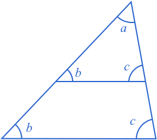
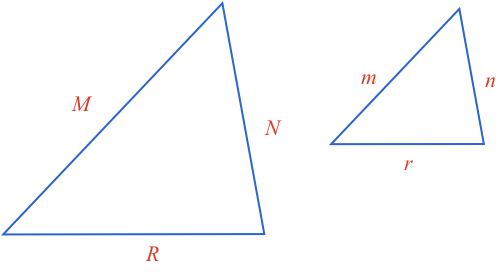
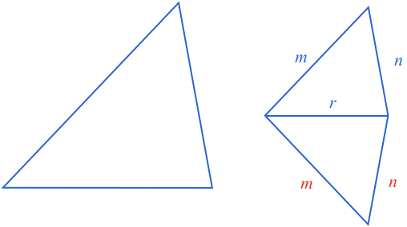

## Similar Triangles

Similar shapes are those that have the same shape but are a different size.

Similar triangles are triangles that have the same angles, and whose corresponding sides are proportional.

### Equiangular Triangles are Similar - Proof

Two triangles that have the same angles can be different sizes.

However, while the sizes may be different, the sizes are still related. Specifically, all pairs of corresponding sides have the same ratio.

We can prove this by overlaying one triangle on the other.

The first observation we can make is the two $$\color{b}b$$ angles are **equal** and [[corresponding angles]]((qr,'Math/Geometry_1/RelatedAngles/base/Corresponding',#00756F)). This means the two horizontal lines are **parallel**.

When a triangle is [[split]]((qr,'Math/Geometry_1/ParallelSplitOfTriangle/base/Triangle',#00756F)) with a parallel line, the smaller triangle's sides will all be scaled by the same proportion.

**Therefore if triangles share the same angles, then their corresponding sides have the same proportion, and they are similar triangles**.

### Proportional Triangles are Similar - Proof

Now what happens if we know two triangles have corresponding sides that are proportional. Are their corresponding angles equal, and therefore are they similar?

We start with two triangles whose corresponding sides are in proportion.

This means each ratio of corresponding sides is the same:

$$\color{b}\frac{M}{m}=\frac{R}{r}\ \ \ \ \ \ \ \ \ \ \frac{M}{m}=\frac{N}{n}\ \ \ \ \ \ \ \ \ \ \frac{R}{r}=\frac{N}{n}$$

Rearranging each of these, we can see it also means the ratio of adjacent sides of one triangle is equal to the ratio of the corresponding adjacent sides of the other.

$$\color{b}\frac{M}{R}=\frac{m}{r}\ \ \ \ \ \ \ \ \ \ \frac{M}{N}=\frac{m}{n}\ \ \ \ \ \ \ \ \ \ \frac{R}{N}=\frac{r}{n}$$

Now, do such triangles have equal corresponding angles? We can look at this by drawing a third triangle that shares a side with side $$\color{b}A$$, and has the angles $$\color{b}b$$ and $$\color{b}c$$ from the larger triangle.

Now as both the new triangle, and large triangle have two angles defined, and a triangles angles [[add]]((qr,'Math/Geometry_1/Triangles/base/AngleSum',#00756F)) to 180º, then their third angle must be the same.

This means the large triangle and the new triangle are similar:

$$\color{b}\frac{M}{R}=\frac{p}{r}\ \ \ \ \ \ \ \ \ \ \frac{M}{N}=\frac{p}{q}\ \ \ \ \ \ \ \ \ \ \frac{R}{N}=\frac{r}{q}$$

But we started with:

$$\color{b}\frac{M}{R}=\frac{m}{r}\ \ \ \ \ \ \ \ \ \ \frac{M}{N}=\frac{m}{n}$$

Therefore:

$$\color{b}m=p\ \ \ \ \ \ \ \ \ \ n=q$$

Now, the two small triangles share three side lengths, meaning they are [[congruent]]((qr,'Math/Geometry_1/CongruentTriangles/base/Sss',#00756F)), and therefore have the same angles.

And so **two triangles whose corresponding sides are in proportion have equal angles and are therefore similar**.

### Summary

**Any two triangles that have the same angles**, will also have propotional corresponding sides, and therefore be **similar triangles**.

**Any two triangles that have propotional corresponding sides**, will also have the same corresponding angles and therefore be **similar triangles**.

