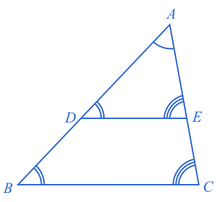

## Similar Triangles

Similar shapes are those that have the same shape but are a different size.

Similar triangles are triangles that have the same angles, and whose corresponding sides are proportional.

### Equiangular Triangles are Similar - Proof

Consider two triangles with **equal angles** overlaid on each other (left). We then label the points, and add in some construction lines (right).

As $$\angle DBC$$ and $$\angle ADE$$ are [[equal corresponding angles]]((qr,'Math/Geometry_1/RelatedAngles/base/Corresponding',#00756F)):

$$\color{b}BC \parallel DE$$

$$\triangle BDE$$ and $$\triangle CDE$$ have equal [[area]]((qr,'Math/Geometry_1/AreaTriangle/base/Main',#00756F)) as they share a base ($$DE$$) and height ([[distance between parallel lines]]((qr,'Math/Geometry_1/ParallelLineDistance/base/Main',#00756F))):

$$\color{b} \triangle_{Area} BDE = \triangle_{Area} CDE$$

Combining these triangles with $$\triangle DAE$$:

$$\color{b} \triangle_{Area} BAE = \triangle_{Area} CDA$$

$$\therefore \color{b} \textstyle\frac{1}{2}BA\ \ FE \ \ =\ \  \textstyle\frac{1}{2}CA\ \ GD$$

$$\therefore \color{b} \frac{BA}{CA}=\frac{GD}{FE} \ \ \ \ \ \ \ \ \color{grey}(1)$$

The area of $$\triangle DAE$$ can be calculated with either $$AD$$ or $$AE$$

$$\color{b} \triangle_{Area} DAE$$ = $$\color{b} \textstyle\frac{1}{2}DA\ \ FE\  =\   \textstyle\frac{1}{2}EA\ \ GD$$

$$\therefore \color{b} \frac{DA}{EA}=\frac{GD}{FE} \ \ \ \ \ \ \ \ \color{grey}(2)$$

Combining $$\color{grey}(1)$$ and $$\color{grey}(2)$$:

$$\color{b} \frac{DA}{EA}=\frac{BA}{CA}$$

$$\therefore \color{b} \frac{DA}{BA}=\frac{EA}{CA}$$

We can then repeat the exercise with triangles overlaid in the lower left corner and will see that:

$$\therefore \color{b} \frac{DA}{BA}=\frac{EA}{CA}=\frac{DE}{BC}$$

Thus any two triangles with the same corresponding angles, will have corresponding sides that have the same proportionality.

### Proportional Triangles are Similar - Proof

If instead you start with two triangles whose **corresponding sides have equal proportion**, then you can show all angles must be equal.

Start by drawing the two proportional triangles $$\triangle ABC$$ and $$\triangle DEF$$, and then drawing an additional triangle along $$DF$$ with the angles $$\angle BAC$$ and $$\angle ACB$$:

As the angles in a triangle [[add]]((qr,'Math/Geometry_1/Triangles/base/AngleSum',#00756F)) to 180º, we know that:

$$\color{b}\angle ABC = \angle DGF$$

Therefore all the corresponding angles of $$\triangle ABC$$ and $$\triangle DFG$$ are equal, and therefore they are similar. Therefore the sides are proportional:

$$\color{b} \frac{AB}{DG} = \frac{AC}{DF} \ \ \ \ \ \ \ \ \color{grey}(1)$$

We started with:

$$\color{b} \frac{AB}{\color{r}{DE}\color{b}} = \frac{AC}{DF} \ \ \ \ \ \ \ \ \color{grey}(2)$$

Combining $$\color{grey}(1)$$ and $$\color{grey}(2)$$:

$$\color{b} DE = DG$$

Using the same process, can similarly show:

$$\color{b} EF = GF$$

Triangles with the same side lengths are [[congruent]]((qr,'Math/Geometry_1/CongruentTriangles/base/Sss',#00756F)), so the angles of $$\triangle DEF$$ will be equal to the angles in $$\triangle DFG$$ and therefore $$\triangle ABC$$.

Therefore $$\triangle ABC$$ and $$\triangle DEF$$ are similar as they have the same angles, and their corresponding sides have the same proportion.

