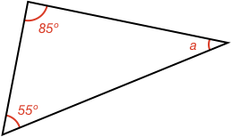

## Triangles

### Example 1:

#### What is the unknown angle $$\definecolor{r}{RGB}{238,34,12}\color{r}a$$ in degrees?

All angles in a triangle always add to 180º, therefore:

$$180^\circ = \color{r}a \color{black}+ \color{r}28^\circ \color{black}+ \color{r}120^\circ \color{black}= \color{r}a \color{black}+ 148^\circ$$

Therefore:

$$\color{r}a \color{black}= 180^\circ - 148^\circ = \bbox[10px,border:1px solid gray]{32^\circ}$$

### Example 2:

#### What is the unknown angle $$\color{r}a$$ in degrees?

All angles in a triangle always add to 180º, therefore:

$$\color{r}a \color{black}= 180^\circ - 85^\circ - 55^\circ = \bbox[10px,border:1px solid gray]{40^\circ}$$

### Example 3:

#### What is the unknown angle $$\color{r}a$$ in degrees?

First calculate angle $$\color{r}b$$ knowing all angles within a triangle add to 180º:

$$\color{r}b \color{black}= 180^\circ - 75^\circ - 65^\circ = 40^\circ$$

Now, $$\color{r}b$$ and $$\color{r}a$$ are [[supplementary]]((qr,'Math/Geometry_1/AngleGroups/base/Supplementary',#00756F)) angles and add to 180º:

$$\color{r}a \color{black}= 180^\circ - 40^\circ = \bbox[10px,border:1px solid gray]{140^\circ}$$

### Example 4:

#### What is the unknown angle $$\color{r}a$$ in degrees?

We can first calculate angles $$\color{r}c$$ and $$\color{r}d$$ as angle $$\color{r}c$$ is [[supplementary]]((qr,'Math/Geometry_1/AngleGroups/base/Supplementary',#00756F)) with the bottom left angle $$\color{r}120^\circ$$ and angle $$\color{r}d$$ is supplementary with the bottom right angle $$\color{r}110^\circ$$:

$$\color{r}c \color{black} = 180^\circ - 120^\circ = 60^\circ$$

$$\color{r}d \color{black} = 180^\circ - 110^\circ = 70^\circ$$

Angle $$\color{r}b$$ can be calculated knowing angles $$\color{r}c$$, $$\color{r}d$$ and the fact that all angles in a triangle add to 180º:

$$\color{r}b \color{black} = 180^\circ - 60^\circ - 70^\circ = 50^\circ$$

Angle $$\color{r}a$$ is [[opposite]]((qr,'Math/Geometry_1/AnglesAtIntersections/base/Opposite',#00756F)) angle $$\color{r}b$$ at the intersection of two lines, and so is equal:

$$\color{r}a \color{black}= \bbox[10px,border:1px solid gray]{50^\circ}$$
