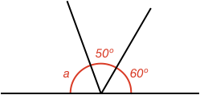
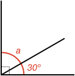

### Example 1:

#### What is size of angle $$\definecolor{r}{RGB}{238,34,12}\color{r}a$$ in degrees?

<hintLow>[Answer]
These angles are **supplementary** angles and add up to 180º. Therefore:

$$\color{r}a \color{black}= 180^\circ - 50^\circ - 60^\circ = \bbox[10px,border:1px solid gray]{70^\circ}$$
</hintLow>

### Example 2:

#### What is size of angle $$\definecolor{r}{RGB}{238,34,12}\color{r}a$$ in degrees?

<hintLow>[Answer]
These angles are **complementary** angles and add up to 90º. Therefore:

$$\color{r}a \color{black}= 90^\circ - 30^\circ = \bbox[10px,border:1px solid gray]{60^\circ}$$
</hintLow>

### Example 3:

#### Find angles $$\color{r}a$$ and $$\color{r}b$$ in the below diagram:

<hintLow>[Answer]
First we can see that angles $$\color{r}a$$ and $$\color{r}60^\circ$$ are **complimentary** angles. Therefore:

$$\color{r}a \color{black}= 90^\circ - 60^\circ = \bbox[10px,border:1px solid gray]{30^\circ}$$

Next we can see that all three angles are **supplementary** angles. Therefore:

$$\color{r}b \color{black} = 180^\circ - 30^\circ - 60^\circ = \bbox[10px,border:1px solid gray]{90^\circ}$$
</hintLow>