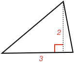
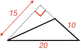
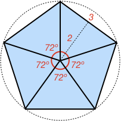

### Example 1:

What is the area of the triangle below?

<hintLow>[Answer]
Triangle area is half the product of triangle base and height.

$$Area =  \textstyle{\frac{1}{2}} \times 3 \times 2 = \bbox[10px,border:1px solid gray]{3}$$
</hintLow>

### Example 2:
What is the area of the triangle below?

<hintLow>[Answer]
When two sides of a triangle are perpendicular, then one side can be considered the base and the other the height. Therefore:

$$Area = \textstyle{\frac{1}{2}} \times 10 \times 15 = \bbox[10px,border:1px solid gray]{75}$$
</hintLow>

### Example 3:
What is the area of the triangle below?

<hintLow>[Answer]
In this case, the perpendicular height of the triangle is 15. Therefore:

$$Area = \textstyle{\frac{1}{2}} \times  10 \times 15 = \bbox[10px,border:1px solid gray]{75}$$
</hintLow>

### Example 4:
What is the area of the shaded blue triangle below?

<hintLow>[Answer]
All internal angles of the dotted shape are right angles, therefore the shape is a [[rectangle]]((qr,'Math/Geometry_1/RectanglesAndSquares/base/Rectangle',#00756F)). A rectangle's opposite sides are equal. Therefore we can see both triangles share the same base and height, and thus have the same area.

Therefore, the area of the blue shaded triangle is:

$$Area = \bbox[10px,border:1px solid gray]{5}$$
</hintLow>

### Example 5:
What is the area of the shaded blue shape?

<hintLow>[Answer]

Some notes from the diagram:
* The shaded blue shape is made up of 5 triangles
* Each triangle is an [[isosceles]]((qr,'Math/Geometry_1/Isosceles/base/Main',#00756F)) triangle as two sides are the radius of the circle and thus the same
* All triangle angles at the center of the circle are the same (the unmarked one is $$360 - 4 \times 72^\circ = 72^\circ$$)
* Therefore by [[SAS]]((qr,'Math/Geometry_1/CongruentTriangles/base/Sas',#00756F)) all triangles are congruent
* Therefore all triangles share the same height and base

Therefore, the area of the blue shaded area is:

$$Area = \textstyle{\frac{1}{2}} \times 5 \times 2 \times 3 = \bbox[10px,border:1px solid gray]{15}$$
</hintLow>

<!-- What is the size of angle $$\definecolor{r}{RGB}{238,34,12}\bbox[10px,border:1px solid gray]{a}$$ in degrees?
 -->
<!-- 

<hintLow>[Answer]
[[triangle]]((qr,'Math/Geometry_1/Triangles/base/AngleSum',#00756F)) 
</hintLow>
 -->

 <!-- $$\bbox[10px,border:1px solid gray]{Yes}$$ -->