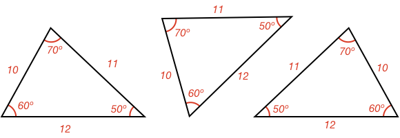
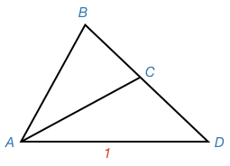
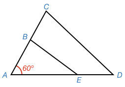
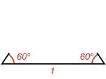

In mathematics, if **two shapes are the same size and shape**, then they are said to be **congruent**.

The word **congruent** comes from _Latin_, where it means _"agreeing, meeting together"_.

For two triangles to be **congruent**, the corresponding **side lengths** and **angles** of each triangle must be the same as the other.

Flipped and rotated triangles still have the same corresponding sides and angles and therefore be congruent.

### Congruence Tests

The easy way to determine if two triangles are congruent is to measure all six sides and angles.

But is there a faster way? What is the number of sides and/or angles you need to know to determine if two triangles are congruent?

If the answer is less than six, then when you determine two triangles are congruent and you don't know all their properties, you may be able to infer one triangle's unknown properties from the other's known properties. 

### One Property

If you just know a single side or angle, is that enough to know whether two triangles are congruent?

<hintLow>

Another way to ask this is: if you fix one side (or angle), how many different triangles can you make?

If the answer is just one, then you know if two triangles have one side that is the same length then they will be congruent.

</hintLow>

<hint>Try drawing a side - how can you build more than one triangle off that side?</hint>

<hint>Try drawing an angle - how can you build more than one triangle off that angle?</hint>

<hintLow>[Answer]

If you start with just a single side, you can make more than one triangle. For example:

If you know one side (in this case of value 1), then triangles ABD and ACD can be built off that side.

If you start with just a single angle, you can also make more than one triangle.

If you know one angle (60º), then triangles ABE and ACD can be formed from it.

In fact, any number of triangles can be formed from either a single side or single angle.

</hintLow>

### Two Properties

What about if you know two properties? Firstly, what are the different combinations of properties? One combination is two sides, what are the others?

<hintLow>[Answer] The combinations are 

* two sides
* two angles
* adjacent side angle
* opposite side angle

</hintLow>

Are any of these combinations suffient to determine if two triangles are congruent?

<hintLow>Try drawing an adjacent side and an angle - can more than one triangle be built? </hintLow>

<hintLow>Try drawing two angles - can more than one triangle be built? What if you change the separation of the angles? </hintLow>

<hint>When drawing two sides, remember the angle between them can be any angle</hint>

<hint>Try out making different triangles with the same side and opposite angle [here](/content/Math/Geometry_1/CongruentTriangles/ta/tri)</hint>

<hintLow>[Answer] Many triangles can be made if you start with just **two properties**. Therefore, two properties are not sufficient to tell whether two triangles are congruent.

Knowing just an **adjacent side-angle** combination is not enough:

In this example, triangles ABD and ACD both share the same side and angle.

Knowing just an **opposite side-angle** combination is not enough:

In this example, both triangles have a right angle opposite a shared side.

Knowing just an **angle-angle** combination is not enough:

In this example, triangles ACD and ABE both share a 60º and 45º angle but are different sizes.

Knowing just a **side-side** combination is not enough:

In this example, triangles ABD or ACD both have sides of value 1 and 1.2. In fact, the side of value 1 can be anywhere on the circle around D, forming many different triangles.

</hintLow>

### Three Properties

What about if you know three properties? Firstly, what are the different combinations of properties? One combination is three sides, what are the others?

<hintLow>[Answer] There are six combinations. Combinations are typlically denoted **property-property-property** or **PPP** where order is how they appear in the triangle.

For example, if you have two angles and a side, it could either be **side-side-angle** (**SSA**) or **side-angle-side** (**SAS**). The **SAS** combination would consist of an angle between two sides like:

whereas **SSA** would be an angle adjacent to just one of the sides:

The six combinations are:

* side-side-side (SSS)
* angle-angle-angle (AAA)
* side-side-angle (SSA)
* side-angle-side (SAS)
* angle-angle-side (AAS)
* angle-side-angle (AAA)

Note that **angle-side-side** is the same as **side-side-angle** as in both an angle is adjacent to only one side. Similarly **angle-angle-side** is the same as **side-angle-angle**.

</hintLow>

Are any of these combinations suffient to determine if two triangles are congruent?

<hint>**Some** of the three property cases will only produce one triangle and therefore be a sufficient test of congruence.
</hint>

<hint>Start with **SAS** or **ASA**. Draw out the fixed properties, then see how many different triangles you can make from them.
</hint>

<hintLow>For **SAS**, how many triangles can be constructed once you start with:

</hintLow>

<hintLow>For **ASA**, how many triangles can be constructed once you start with:

</hintLow>

<hint>The **SSS** case can either be intuited directly, or using a combination of **SAS** and the property of [[isosceles]]((qr,'Math/Geometry_1/Isosceles/base/Main',#00756F)) triangles (later lesson in learning path) that says any triangle with two equal sides will have two equal angles opposite those sides. In fact, you can use **SAS** to show this property is true.</hint>

<hint>For **AAS**, use the total angle of a [[triangle]]((qr,'Math/Geometry_1/Triangles/base/AngleSum',#00756F)) to get to the **ASA** case.
</hint>

<hint>Be careful with the **SSA** case as it can only **sometimes** be a sufficient test of congruence. Can you figure out when?</hint>

<hint>For **AAA**, think about shrinking or zooming out from the triangle. As it gets smaller, do the angles change?</hint>

<hintLow>[Answer]
  The cases that can only make one triangle, and are therefore sufficient to determine if two triangles are congruent are:

* SSS
* ASA
* SAS
* AAS

The **SSA** case is only sufficient if the side opposite to the known angle is longer than or equal to the side adjacent to the angle.

The **AAA** can produce many different sized triangles and is therefore insufficient.

This lesson's [Explanation](/content/Math/Geometry_1/CongruentTriangles/explanation/base) explains how each case is possible or not.

</hintLow>

### More than three properties

What about if you know four or five properties? Are any of these combinations sufficeint to determine congruence?

<hint>Do four and five combinations of properties have the known three property combinations?</hint>

<hintLow>[Answer]
All combinations of four or five properties have within them either three sides, or 
one side and two angles. As **SSS**, **AAS** and **ASA** are all sufficient tests of congruence, then all combinations of four or five properties will also be sufficient tests of congruence.
</hintLow>
