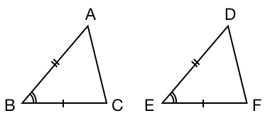
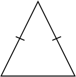
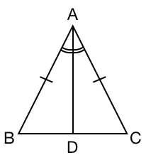
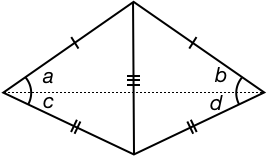
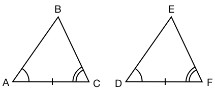
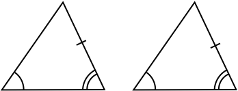

Triangles are said to be congruent if all their corresponding side lengths and angles are the same.

If triangles are moved, rotated or flipped their corresponding sides and angles are still the same, and therefore they are still congruent.

Determining two triangles are congruent without measuring all the angles and sides is tremendously useful, as unknown sides and angles can be inferred from the congruent triangle.

Congruent triangles are an important part of many geometric proofs, like showing an isosceles triangle has two equal angles, and showing a rectangle's opposite sides are equal.

You need at least three properties to show two triangles are congruent, but not all combinations of three properties are sufficient.

Here we will start with the SAS combination of properties, and from this show the other possible combinations.

### SAS - Side Angle Side Congruence

Consider two triangles ($$\triangle ABC$$, $$\triangle DEF$$) that have the same Side-Angle-Side combination (in other words, the angle is between the two sides).

Here we have

* $$AB = DE$$
* $$BC = EF$$
* $$\angle ABC = \angle DEF$$

Now, lets move the triangle $$\triangle DEF$$ onto $$\triangle ABC$$ such point $$D$$ is placed upon $$A$$ and $$E$$ upon $$B$$.

As angle $$\angle ABC = \angle DEF$$, then lines $$BC$$ and $$EF$$ must also align.

As length $$BC = EF$$, then points $$C$$ and $$F$$ must be at the same position.

As $$C$$ and $$F$$ are at the same position, and $$A$$ and $$D$$ are at the same position, then the sides $$AC$$ and $$DF$$ align and the triangles are the same.

This method of showing SAS is commonly called **superposition** and was first used by Euclid \~2300 years ago.

### Isosceles Triangle

An Isosceles triangle is a triangle that has two equal side lengths.

Draw a line from the angle between the equal sides to its opposite side such that the angle is split in half.

We now have two triangles $$\triangle ABD$$ and $$\triangle ADC$$.

We can use SAS to show these triangles are congruent as:

* $$AB=AC$$
* $$\angle DAB = \angle DAC$$ as we split $$\angle BAC$$ in half
* $$AD$$ is shared

As they are congruent then $$\angle ABC = \angle ACB$$. In other words for an isosceles triangle the angles opposite the equal sides are also equal.

### SSS - Side Side Side Congruence

Now if we have two triangles with the same side lengths. Do they have the same angles and are therefore congruent?

We can flip one triangle and align its side to the corresponding side of the other to create two isosceles triangles:

Each isosceles triangle has equal angles opposite the equal sides and so

* $$\angle a = \angle b$$
* $$\angle c = \angle d$$

Angles $$\angle a$$ and $$\angle c$$ combine to give the original angle of the triangle so

* $$\angle a + \angle c = \angle b + \angle d$$

By SAS these triangles are **congruent**.

Thus, any two triangles with the same side lengths will be **congruent**.

### ASA - Angle Side Angle Congruence

Now consider two triangles that have the same corresponding Angle-Side-Angle combination.

If $$AB = DE$$ or $$BC = EF$$ then from SAS the two triangles would be congruent, so lets assume $$AB \neq DE$$ and $$BC \neq EF$$.

As $$AB \neq DE$$, we can draw a point $$G$$ on $$DE$$ such that $$DG = AB$$. Note, $$G$$ could also be longer than $$DE$$ and the same logic will apply.

As $$DG = AB$$, $$\angle BAC = \angle GDF$$ and $$AC = DF$$, then from SAS triangle $$\triangle DGF$$ is congruent with $$\triangle ABC$$.

Therefore $$BC = GF$$ and $$\angle ACB = \angle DFG$$.

If point $$G$$ is not at the same position as $$E$$, then $$DFG \neq DFE$$.

We now have an inconsistency:

* $$ACB = DFE\ \ $$ (given)
* $$ACB = DFG\ \ $$ (found)
* $$DFG \neq DFE\ \ $$ (found)

The only way we can make this work is if point $$G$$ **is** at the same position as $$E$$, which means the triangles are **congruent**.

Therefore any two triangles that share the same Angle-Side-Angle combination will be **congruent**.

### AAS - Angle Angle Side Congruence

Next we consider the case of two triangles with the same Angle-Angle-Side combination.

As we know the angles of a [[triangle]]((qr,'Math/Geometry_1/Triangles/base/AngleSumPres',#00756F)) always sum to 180º, then we can calculate the third angle.

This now gives us the ASA case.

Therefore, any two triangles that share the same Angle-Angle-Side combinatino will be **congruent**.

