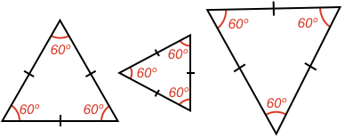

### Definition

A triangle that has all sides the **same length** is called an **equilateral** triangle.

The word equilateral comes from the Latin _aequilateralis_ where _aequi_ means _"equal"_ and _lateralis_ means _"side"_.

### Angle, Side Relationship

When three sides of a triangle are equal, the triangle's angles have a special relationship. Can you figure out what it is?

<hintLow>Here are some examples of equilateral triangles. Can you see the pattern in the angles? 
</hintLow>

<hint>[Answer]All angles in an equilateral triangle are 60º</hint>

Can you prove this relationship?

<hint>An equilateral triangle is a special form of an [[isosceles]]((qr,'Math/Geometry_1/Isosceles/base/Main',#00756F)) triangle</hint>

<hintLow>[Answer]
The equilateral triangle is a special form of an [[isosceles]]((qr,'Math/Geometry_1/Isosceles/base/Main',#00756F)) triangle. If you consider each pair of sides, the pair of opposite angles will be equal.

When you combine all pairs, you see all angles are equal.

This can be seen in more detail in this lesson's [Explanation](/content/Math/Geometry_1/Equilateral/explanation/base?page=1)

</hintLow>

If a triangle has all equal angles, does that mean its sides are also equal?

<hintLow>[Answer]
If a triangle has two angles the same, then it is an [[isosceles]]((qr,'Math/Geometry_1/Isosceles/base/Main',#00756F)) triangle with the two sides opposite the angles being the same length.

Therefore, each pair of angles can be considered separately to show each side is equal.

</hintLow>

If you know a triangle is an equilateral triangle, can you calculate its angles?

<hintLow>[Answer]Yes.

As the sum of angles in a [[triangle]]((qr,'Math/Geometry_1/Triangles/base/AngleSum',#00756F)) is 180º, then we have:

$$180^\circ= a + a + a = 3a$$

$$a = 60^\circ$$

So all equialteral triangles have interal angles of 60º only.

</hintLow>