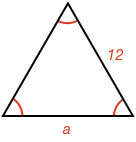
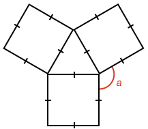

### Example 1:

What is the length of side $$\definecolor{r}{RGB}{238,34,12}\color{r}a$$?

<hintLow>[Answer]
All angles are equal, therefore this is an equilateral triangle. In an equilateral triangle, all sides are also equal. Therefore:

$$\color{r}a \color{black}= \bbox[10px,border:1px solid gray]{12}$$
</hintLow>

### Example 2:

What is the size of angle $$\definecolor{r}{RGB}{238,34,12}\color{r}a$$ in degrees?

<hintLow>[Answer]
All sides are equal, therefore this is an equilateral triangle. In an equilateral triangle, all angles are 60º. Therefore:

$$\color{r}a \color{black}= \bbox[10px,border:1px solid gray]{60^\circ}$$
</hintLow>

### Example 3:

What is the size of angle $$\definecolor{r}{RGB}{238,34,12}\color{r}a$$ in degrees?

<hintLow>[Answer]
Here we have three [[squares]]((qr,'Math/Geometry_1/RectanglesAndSquares/base/Square',#00756F)) arranged so their corners are touching. Each square corner has an angle of 90º.

The triangle between the squares has equal sides, so it is an equilateral triangle and has interanl angles of 60º.

All the angles at $$\color{r}a$$ are [[explementary]]((qr,'Math/Geometry_1/AngleGroups/base/Explementary',#00756F)) angles which sum to 360º. Therefore:

$$\color{r}a \color{black}= 360^\circ - 90^\circ - 90^\circ - 60^\circ = \bbox[10px,border:1px solid gray]{120^\circ}$$
</hintLow>

### Example 4:

What is the size of angle $$\definecolor{r}{RGB}{238,34,12}\color{r}a$$ in degrees?

<hintLow>[Answer]
We have two circles with radius R centered on the ends of a line with length R.

The points at which the circles intersect forms an equilateral triangle with the line between the circle centers. Therefore:

$$\color{r}a \color{black}= \bbox[10px,border:1px solid gray]{60^\circ}$$
</hintLow>