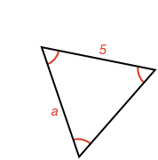

<html>
Round answers to two decimal places
</html>

### Question 1:

What is the the length of a?

<quiz entry2>5</quiz>

### Question 2:

What is the angle a in degrees?

<quiz entry2>60</quiz>

### Question 3:

What is the length a?

<quiz multichoice>
  - 6
  - 3.14
  + 3
  - 2.5
</quiz>

### Question 4:

What is the angle a in degrees?

<quiz entry2>60</quiz>

### Question 5:

What is the angle a in degrees?

<quiz entry2>60</quiz>

<!-- 
What is the radius of a circle that has a circumference of $|q1C|$?

<quiz entry2>$|q1R|$</quiz>
 -->

 <!-- <quiz multichoice>
  - 10
  - 15.7
  + 5
  - 2.5
  - 15
</quiz> -->