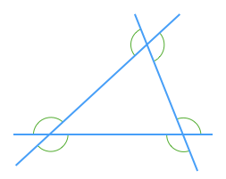

Consider a triangle with one of its sides extended beyond the corner.

The angle $$\definecolor{b}{RGB}{0,162,255}\definecolor{r}{RGB}{238,34,12}\definecolor{g}{RGB}{29,177,0}\definecolor{gr}{RGB}{100,100,100}\color{g}d$$ is an **external angle** (also called exterior angle). Can you find the relationship between angles $$\color{r}a$$, $$\color{r}b$$ and $$\color{g}d$$?

<hint>[Hint 1]The sum of angles in a [[triangle]]((qr,'Math/Geometry_1/Triangles/base/AngleSum',#00A89D)) is 180º</hint>

<hint>[Hint 2]Angles $$\color{gr}c$$ and $$\color{g}d$$ are [[supplementary]]((qr,'Math/Geometry_1/AngleGroups/base/Supplementary',#00A89D))</hint>

<hintLow>[Answer]

<!-- $$\bbox[20px,border:1px solid red]{\color{r}a\color{black}+\color{r}b\color{black}\color{black}=\color{g}d}$$
 -->

$${\color{r}a\color{black}+\color{r}b\color{black}\color{black}=\color{g}d}$$

See this topic's [Explanation](/content/Math/Geometry_1/ExternalAngles/explanation/base) for the proof</hintLow>

How many external angles does a triangle have?

<hintLow>[Answer]A triangle has **six** external angles: </hintLow>
