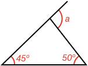

## External Angles of a Triangle Calculations

### Example 1:

#### What is the size of angle $$\definecolor{r}{RGB}{238,34,12}\color{r}a$$ in degrees?

Angle $$\color{r}a$$ is an external angle of a triangle. The external angle of a triangle is equal to the sum of the two internal opposite angles. Therefore:

$$\color{r}a \color{black} = 105^\circ + 25^\circ = \bbox[10px,border:1px solid gray]{130^\circ}$$

### Example 2:

#### What is the size of angle $$\definecolor{r}{RGB}{238,34,12}\color{r}a$$ in degrees?

The external angle $$\color{r}a$$ of the triangle is equal to:

$$\color{r}a \color{black} = 45^\circ + 50^\circ = \bbox[10px,border:1px solid gray]{95^\circ}$$

### Example 3:

#### What is the size of angle $$\definecolor{r}{RGB}{238,34,12}\color{r}a$$ in degrees?

There are several ways to calculate this. The way we will use is to see that angle $$\color{r}a$$ is an external angle of a triangle and the two internal opposite angles are 125º and the [[supplementary]]((qr,'Math/Geometry_1/AngleGroups/base/Supplementary',#00756F)) angle of 150º. Therefore:

$$\color{r}a \color{black} = 180^\circ - 150^\circ + 125^\circ = \bbox[10px,border:1px solid gray]{155^\circ}$$