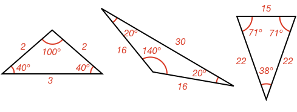
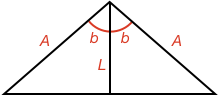
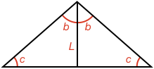

### Isosceles Triangle

There are several types of triangle commonly found in many applications.

Being able to identify these types of triangle can make analysing a problem quicker and easier.

Triangles are commonly grouped by either their side lengths or angles.

A triangle with **two sides of equal length** is called an **isosceles** triangle.

The word isosceles comes from the Greek word _isoskeles_ which is formed from _isos_ meaning _"equal"_ and _skelos_ meaning _"leg"_. In other words, an isosceles triangle is a triangle with two equal legs.

### Angle, Side Relationship

When two sides of a triangle are equal, the triangle's angles have a special relationship. Can you figure out what it is?

<hintLow>Here are some examples of isosceles triangles. Can you see the pattern in the angles? 
</hintLow>

<hint>[Answer]The angles opposite the equal sides are equal</hint>

Can you prove this?

<hint>You can use the [[SAS]]((qr,'Math/Geometry_1/CongruentTriangles/base/Sas',#00756F)) congruence test to prove this</hint>

<hint>Draw a line from the angle between the equal sides, to the opposite side such that the line splits the angle into equal angles</hint>

<hintLow>[Answer]If you draw a line from the angle between the equal sides, to the opposite side such that the line splits the angle in two equal pieces, then you have two triangles.

Each triangle has the same side-angle-side (A-b-L) combination, and so using [[SAS]]((qr,'Math/Geometry_1/CongruentTriangles/base/Sas',#00756F)) we can say the two triangles are congruent.

If the triangles are congruent, then all their angles must be equal, and thus the angles opposite the equal sides must be equal.

**Therefore all isosceles triangles have two equal sides and two equal angles opposite the equal sides.**

A more descriptive explanation of this can be found in this topic's [Explanation](/content/Math/Geometry_1/Isosceles/explanation/base?page=4)

</hintLow>

If a triangle has two equal angles, will that mean it has two equal sides and is therefore an isosceles triange? Can you prove either way?

<hint>Try the same procedure but starting with two equal angles instead of two equal sides</hint>

<hintLow>[Answer]If you draw a line from the angle that is not one of the equal angles, to the opposite side such that the line splits the angle in two equal pieces, then you have two triangles.

Each triangle has the same angle-angle-side (c-b-L) combination, and so using [[AAS]]((qr,'Math/Geometry_1/CongruentTriangles/base/Aas',#00756F)) we can say the two triangles are congruent.

If the triangles are congruent, then all their sides must be equal, and thus the sides opposite the equal angles must be equal.

**Therefore all triangles that have two equal angles are isosceles triangles and have two equal sides.**

A more descriptive explanation of this can be found in this topic's [Explanation](/content/Math/Geometry_1/Isosceles/explanation/base?page=24)
</hintLow>

If you know a triangle is an isosceles triangle, and you know which sides are the same, how many angles do you need to know to calculate all three?

<hintLow>[Answer]You only need to know one angle to calculate all three.

As all angles in a [[triangle]]((qr,'Math/Geometry_1/Triangles/base/AngleSum',#00756F)) add to 180 and as two angles are the same, then we have:

$$180^\circ = c + c + a$$

Therefore:

$$a = 180^\circ - 2c$$

$$c = \frac{180^\circ - a}{2}$$

</hintLow>

### Split line

If a line is drawn from the angle between the equal sides, to the opposite side, and that line splits the angle in two equal pieces, how does it split the opposite side (from both a length and angle perspective)?

<hint>Use the same procedure again to determine this</hint>

<hintLow>[Answer]Similar to before, splitting the angle between the equal sides results in two congruent triangles.

As the triangles are congruent, then their angles and side lengths must be the same.

Therefore, as B = B, then the side opposite the angle is split in half.

As d = d and d + d = 180º, then d = 90º.
</hintLow>
<!-- 
A special type of [[quadrangle]]((qr,'Math/Geometry_1/Quadrangles/base/Main',#00756F)) is one where all the angles are **90º**. This shape is called a **rectangle**.

The word **rectangle** comes from the latin words _rectus_ which is _"right"_ and _angulus_ which is _"angle, corner"_.

## Side Relationships

A rectangle's opposite sides are parallel and equal. Can you prove this?

<hint>First prove they are parallel</hint>

<hint>To show they are parallel, use [[interior]]((qr,'Math/Geometry_1/AnglesAtIntersections/base/Interior',#00756F)) angles</hint>

<hint>You can use the [[AAS]]((qr,'Math/Geometry_1/CongruentTriangles/base/Aas',#00756F)) congruence test to show opposite sides are equal</hint>

<hintLow>[Answer]This topic's [Explanation](/content/Math/Geometry_1/RectanglesAndSquares/explanation/base) shows the proof that opposite sides are parallel and equal</hintLow>

## Square

A special type of rectangle is one where **all sides are equal**. This shape is called a **square**.

The word **square** comes from the old French word _esquare_ which itself comes from the Latin word _quadra_, both of which mean _"square"_.
 -->