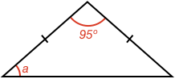
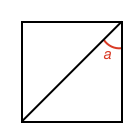
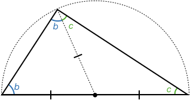

### Example 1

What is the size of angle $$\definecolor{r}{RGB}{238,34,12}\color{r}a$$ in degrees?

<hintLow>[Answer]
The shape is an isosceles triangle, and therefore the angles opposite the equal sides are equal. As we know the angles in a [[triangle]]((qr,'Math/Geometry_1/Triangles/base/AngleSum',#00756F)) add to 180º, then:

$$180^\circ = \color{r}a \color{black} + \color{r}a \color{black} + 95^\circ$$

$$\color{r}a \color{black}= \bbox[10px,border:1px solid gray]{42.5^\circ}$$
</hintLow>

### Example 2

What is the length of side $$\color{r}a$$?

<hintLow>[Answer]
The triangle has two equal angles, and is therefore an isosceles triangle. As such, the sides opposite the equal angles will be equal in length. Therefore:

$$\color{r}a \color{black}= \bbox[10px,border:1px solid gray]{23}$$
</hintLow>

### Example 3

A square is split with a line between opposite corners. What is angle $$\color{r}a$$ in degrees?

<hintLow>[Answer]
A [[square's]]((qr,'Math/Geometry_1/RectanglesAndSquares/base/Square',#00756F)) sides are all equal, therefore the triangles that form the split square are isosceles triangles.

We also know the square corner angle is 90º, and so therefore the angle $$\color{r}a$$ is:

$$\color{r}a \color{black} = \frac{180^\circ - 90^\circ}{2} = \bbox[10px,border:1px solid gray]{45^\circ}$$
</hintLow>

### Example 4

Show that any triangle made from the diameter of a circle and a point on the circle has the same angle $$\color{r}a$$?

<hintLow>[Answer]

We can use isosceles triangles to solve this problem. Start by considering just one triangle and drawing a line from the point at angle $$\color{r}a$$ to the center of the circle:

As the circle's radius is a constant length, we have effectively created two isosceles triangles. Each triangle has equal angles $$\definecolor{g}{RGB}{29,177,0}\definecolor{b}{RGB}{0,118,186}\color{b}b$$ and $$\color{g}c$$.

Now sum the original triangle's angles:

$$\color{b}b \color{black}+ \color{b}b \color{black}+ \color{g}c \color{black}+ \color{g}c \color{black} = 180^\circ$$

$$2\left (\color{b}b \color{black}+ \color{g}c \color{black}\right ) = 180^\circ$$

$$\color{b}b \color{black}+ \color{g}c \color{black}= 90^\circ$$

This answer does not depend on the actual values of $$\color{b}b$$ and $$\color{g}c$$, as it says they will always sum to the same angle.

Therefore, all triangles that have one side as the diameter of the circle, and the other two sides meet at a point on the circle will have an angle opposite the diameter of:

$$\bbox[10px,border:1px solid gray]{90^\circ}$$

</hintLow>

### Example 5

A $$\color{r}line$$ is drawn between two points of a circle (also called a chord). Show that a triangle formed from this line and any point on the circle on the _same side_ of the line will have the same angle.

<hintLow>[Answer]
Start by considering one triangle, and drawing lines between each of the triangle vertices and the circle center.

Three isosceles triangles are formed. We can label each of the equal angles, then sum all the angles of the original triangle.

$$\definecolor{v}{RGB}{203,41,123}\left (\color{b}b \color{black}+ \color{g}c \color{black} \right ) + \left (\color{b}b \color{black}+ \color{v}d \color{black} \right ) + \left (\color{g}c \color{black}+ \color{v}d \color{black} \right ) \color{black} = 180^\circ$$

$$\color{b}2b \color{black}+ \color{g}2c + \color{black} + \definecolor{v}{RGB}{203,41,123}\color{v}2d \color{black} = 180^\circ$$

$$\color{b}b \color{black}+ \color{g}c \color{black} + \color{v}d \color{black} = 90^\circ$$

Angle $$\color{r}a$$ of the triangle is the sum of $$\color{b}b$$ and $$\color{g}c$$:

$$\bbox[10px,border:1px solid gray]{\color{r}a \color{black}= \color{b}b \color{black}+ \color{g}c \color{black} = 90^\circ - \color{v}d}$$

This says $$\color{r}a$$ is **only dependent** on angle $$\color{v}d$$, which stays **constant** at any location of the top point.

_Note:_ If the center of the circle is on the edge of, or outside the triangle, the geometry will look a little different, but the procedure and end result is the same.

</hintLow>

### Example 6

If a triangle is formed on the other side of the chord from Example 5, show that it too will have a constant angle opposite the chord, and show what the relationship is between this angle and the one from Example 5.

<hintLow>[Answer]
You can follow the same procedure from **Example 5** to find the angle. First consider just a single triangle, and draw lines from its vertices to the circle center.

This creates three isosceles triangles. Now sum all the angles of the original triangle:

$$\left (\color{b}b \color{black}- \color{v}d \color{black} \right ) + \left (\color{b}b \color{black}+ \color{g}c \color{black} \right ) + \left (\color{g}c \color{black}- \color{v}d \color{black} \right ) \color{black} = 180^\circ$$

$$\color{b}2b \color{black}+ \color{g}2c  \color{black} - \color{v}2d \color{black} = 180^\circ$$

$$\bbox[10px,border:1px solid gray]{\color{b}b \color{black} + \color{g}c \color{black} = 90^\circ + \color{v}d}$$

Once again the angle opposite the chord is constant, depending only on $$\color{v}d$$ which doesn't change for different triangles.

Now, if we add the two angles on either side of the chord together:

$$\left (90^\circ - \color{v}d \color{black} \right ) + \left ( 90^\circ + \color{v}d \color{black} \right)= 180^\circ$$

The sum of the two angles is 180º and they are thus [[supplementary]]((qr,'Math/Geometry_1/AngleGroups/base/Supplementary',#00756F)).

</hintLow>
