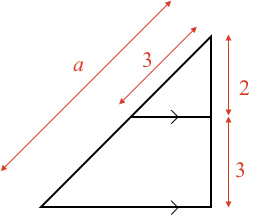

## Triangles split with parallel lines

### Example 1:

#### What is the length of side$$\definecolor{r}{RGB}{238,34,12}{a}$$?

<hintLow>[Answer]
The larger triangle has a side length of 5 on the right, and is split down to a side length of 2.

The ratio of this split is then $$\frac{5}{2}$$.

Applying the same ratio to the left side then:

$$\frac{\color{r}a\color{black}}{3} = \frac{5}{2}$$

$$\color{r}a \color{black}=\bbox[10px,border:1px solid gray]{7.5}$$

</hintLow>

 

 <!-- [[triangle]]((qr,'Math/Geometry_1/Triangles/base/AngleSum',#00756F))  -->