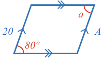
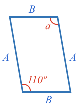
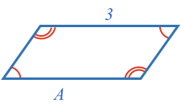
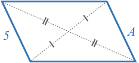
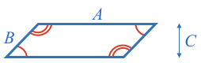
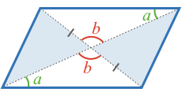
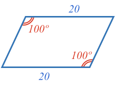
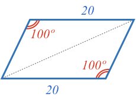

### Example 1

What is the size of angle $$\definecolor{g}{RGB}{29,177,0}\definecolor{b}{RGB}{0,118,186}\definecolor{r}{RGB}{238,34,12}\color{r}{a}$$ and side $$\color{b}A$$?

<hintLow>[Answer]
A quadrangle with parallel opposite sides is a parallelogram. A parallelogram has the properties of:

* Equal opposite angles
* Equal opposite side lengths

Therefore:

$$\color{r}a \color{black}= \bbox[10px,border:1px solid gray]{\color{r}80^\circ}$$

$$\color{b}A \color{black}= \bbox[10px,border:1px solid gray]{\color{b}20}$$
</hintLow>

### Example 2
What is the size of angle $$\color{r}{a}$$?

<hintLow>[Answer]
Any quadrangle that has equal opposite sides is a parallelogram.

A parallelogram has equal opposite angles. Therefore:

$$\color{r}a \color{black}= \bbox[10px,border:1px solid gray]{\color{r}110^\circ}$$
</hintLow>

### Example 3
What is the size of side $$\color{b}{A}$$?

<hintLow>[Answer]

Any quadrangle that has equal opposite angles is a parallelogram.

A parallelogram has equal opposite side lengths. Therefore:

$$\color{b}A \color{black}= \bbox[10px,border:1px solid gray]{\color{b}3}$$

</hintLow>

### Example 4
What is the size of side $$\color{b}{A}$$?

<hintLow>[Answer]

Any quadrangle that has diagonals that intersect at their midpoint is a parallelogram.

A parallelogram has equal opposite side lengths. Therefore:

$$\color{b}A \color{black}= \bbox[10px,border:1px solid gray]{\color{b}5}$$

</hintLow>

### Example 5
What is the area of the shape?

<hintLow>[Answer]

Any quadrangle that has equal opposite angles is a parallelogram.

A parallelogram's area is the product of one of it's sides and the distance between that side and its opposite.

$$\color{b}Area \color{black}= \color{b}A \color{black} \times \color{b}C \color{black} = \bbox[10px,border:1px solid gray]{\color{b}5}$$

In this case, $$\color{b}B$$ is unneeded information.
</hintLow>

### Example 6
Is this shape a parallelogram?

<hintLow>[Answer]
First we recognise there are four triangles made by the diagonals, and there are equal [[opposite angles]]((qr,'Math/Geometry_1/AnglesAtIntersections/base/Opposite',#00756F)) at the intersection of the diagonals.

We will just draw one pair of angles:

The top and bottom triangles are congruent by [[AAS]]((qr,'Math/Geometry_1/CongruentTriangles/base/Aas',#00756F)). Therefore, the corresponding sides of the triangles are equal.

The diagonals are both split at their midpoints, therefore this shape is a parallelogram.

$$\bbox[10px,border:1px solid gray]{Yes}$$
</hintLow>

### Example 7
Is this shape a parallelogram?

<hintLow>[Answer]
Start by drawing a diagonal and recongnizing we can potentially use [[SSA]]((qr,'Math/Geometry_1/CongruentTriangles/base/Aas',#00756F)) to determine if the two triangles are congruent.

SSA can only be used if the side opposite the known angle is longer than or equal to the side adjacent.

In this case, the known angle is 100º. We know from a [[triangle's side angle relationship]]((qr,'Math/Geometry_1/SideAngleRelationship/base/Main',#00756F)) that a larger angle is always opposite a longer side compared to a smaller angle. As a triangle's angles [[add to 180º]]((qr,'Math/Geometry_1/Triangles/base/AngleSum',#00756F)), and 100º is larger than half of 180º, then it must be the largest angle in the triangle.

Therefore, the side opposite the 100º angle, the diagonal, is the longest side, meaning we can use SSA to determine the two triangles are congruent.

As the two triangles are congruent, the corresponding sides of each triangle must be equal, resulting in the shape having equal opposite sides, and therefore being a parallelogram.

$$\bbox[10px,border:1px solid gray]{Yes}$$
</hintLow>

<!-- 

<hintLow>[Answer]
[[triangle]]((qr,'Math/Geometry_1/Triangles/base/AngleSum',#00756F)) 
</hintLow>

 $$\bbox[10px,border:1px solid gray]{Yes}$$ -->