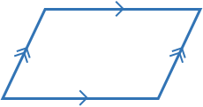
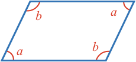
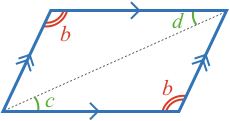
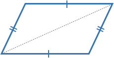
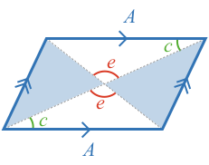
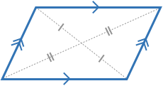
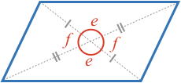
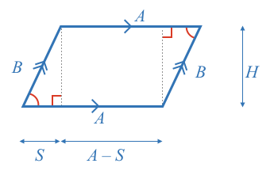

### Definition

A **parallelogram** is a shape with four sides [[quadrangle or quadrilateral]]((qr,'Math/Geometry_1/Quadrangles/base/Main',#00756F))  that has **parallel opposite sides**.

The properties of the parallelogram and their converse implications are detailed below:

* [Opposite Angles](#angles)
* [Opposite Angles - Converse](#angles-converse)
* [Opposite Sides](#sides)
* [Opposite Sides - Converse](#sides-converse)
* [Opposite Diagonal Intersection](#diagonals)
* [Opposite Diagonal Intersection - Converse](#diagonals-converse)
* [Area](#area)

### Opposite Angles 

Consider the four angles of a parallelogram.

As opposite lines are parallel, then all adjacent [[interior angles]]((qr,'Math/Geometry_1/AnglesAtIntersections/base/Interior',#00756F)) must sum to 180º.

$$\definecolor{g}{RGB}{29,177,0}\definecolor{b}{RGB}{0,118,186}\definecolor{r}{RGB}{238,34,12}\color{r}b\color{black}=180^\circ-\color{r}a$$

$$\color{r}b\color{black}=180^\circ-\color{r}c$$

$$\color{r}d\color{black}=180^\circ-\color{r}a$$

Thus:

$$\color{r}b\color{black}=\color{r}d$$ and $$\color{r}a\color{black}=\color{r}c$$

So **opposite angles are equal**.

### Opposite Angles - Converse 

Consider a quadrangle with equal opposite angles:

A quadrangles angles always [[add to 360º]]((qr,'Math/Geometry_1/Quadrangles/base/Main',#00756F))

$$360^\circ = 2\color{r}a \color{black}+ 2\color{r}b$$

Thus: $$180^\circ = \color{r}a \color{black}+ \color{r}b$$

When [[interior angles]]((qr,'Math/Geometry_1/AnglesAtIntersections/base/Interior',#00756F)) of two intersected lines equal 180º, then the lines must be parallel.

**Any quadrangle with equal opposite angles is a parallelogram.**

### Opposite Sides 

Consider a parallelogram with equal opposite angles $$\color{r}b$$, a diagonal, and marked angles $$\color{g}c$$ and $$\color{g}d$$.

Angles $$\color{g}c$$ and $$\color{g}d$$ are [[alternalte angles between parallel lines]]((qr,'Math/Geometry_1/AnglesAtIntersections/base/Alternate',#00756F)). Therefore:

$$\color{g}c \color{black}= \color{g}d$$

Both triangles formed by the diagonal are congruent by [[AAS]]((qr,'Math/Geometry_1/CongruentTriangles/base/Aas',#00756F)) (angles $$\color{r}b$$, $$\color{g}c$$ and the diagonal).

So the triangle's corresponding sides are equal.

**Therefore a parallelogram's opposite sides are equal.**

### Opposite Sides - Converse 

Consider a quadrangle with equal opposite sides and marked diagonal.

By [[SSS]]((qr,'Math/Geometry_1/CongruentTriangles/base/Sss',#00756F)) the two triangles are congruent.

Therefore corresponding triangle angles are equal.

Therefore quadrangle opposite angles are equal, and the shape must be a parallelogram.

**Any quadrangle with equal opposite sides is a parallelogram.**

### Diagonal Intersection 

Consider a parallelogram with marked diagonals forming four internal triangles, equal sides $$\color{b}A$$, equal angles $$\color{g}c$$, and equal angles $$\color{r}e$$.

We showed angles $$\color{g}c$$ are equal in [Sides](#sides).

Angles $$\color{r}e$$ are equal as they are [[opposite angles]]((qr,'Math/Geometry_1/AnglesAtIntersections/base/Opposite',#00756F)).

The top and bottom internal triangles (unshaded) are congruent by [[AAS]]((qr,'Math/Geometry_1/CongruentTriangles/base/Aas',#00756F)) ($$\color{r}e$$, $$\color{g}c$$, $$\color{b}A$$).

Mark in the congruent sides:

So we can see the diagonals are each split in half.

**Parallelograms have diagonals that intersect at their mid points.**

### Diagonal Intersection - Converse 

Consider a quadrangle with diagnols that intersect at their midpoints. At the intersection, there are two pair of [[equal opposite angles]]((qr,'Math/Geometry_1/AnglesAtIntersections/base/Opposite',#00756F)), labled $$\color{r}e$$ and $$\color{r}f$$.

By [[SAS]]((qr,'Math/Geometry_1/CongruentTriangles/base/Sas',#00756F)) the top and bottom triangles are congruent. Therefore the top side and bottom side have equal length.

Similarly the left and right triangles are congruent, and the left and right side have equal length.

Thus we have a quadrangle with opposite sides of equal length, which is a parallelogram.

**Any quadrangle with diagonals that intersect at the midpoints will be paralleograms.**

### Area 

Consider a parallelogram that has been split into a rectangle and two right angle triangles.

By [[AAS]]((qr,'Math/Geometry_1/CongruentTriangles/base/Sas',#00756F)), the right angle triangles are congruent.

Therefore, their side length $$\color{b}S$$ along the parallelogram side $$\color{b}A$$ is the same.

The area of the parallelogram is the sum:

$$\color{b}Area \color{black}= \color{b}Area_{rectangle} \color{black}+ 2\color{b}Area_{triangle}$$

$$\color{b}Area \color{black}= (\color{b}A \color{black}- \color{b}S\color{black})\color{b}H \color{black}+ 2\color{b}SH$$

$$\color{b}Area \color{black}= \color{b}AH$$

**The area of a parallelogram is the product of a side length and the height of the parallelogram from that side.**

<!-- ## Pythagorean Theorem

### Example Equation:

$$\definecolor{g}{RGB}{29,177,0}\definecolor{b}{RGB}{0,118,186}\definecolor{r}{RGB}{238,34,12}\definecolor{v}{RGB}{203,41,123}\defineColor{gr}{100,100,100}$$

\bbox[10px,border:1px solid gray]{}
### Example Image

### Example QR
[[here]]((qr,'Math/Geometry_1/Triangles/base/AngleSumPres',#00756F)) -->