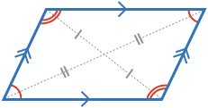

A **parallelogram** is a four sided shape with parallel opposite sides. It's properties are opposite sides are equal, opposite angles are equal, diagonals intersect at their midpoints. Conversely, if a four sided shape has any of these properties, it is a parallelogram.

A parallelogram's area is: Area = A × H.