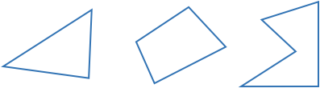

## Title
<!-- 

<hintLow>
Here are several triangles:

[[isosceles]]((qr,'Math/Geometry_1/Isosceles/base/Main',#00756F)) 

[Explanation](/content/Math/Geometry_1/SideAngleRelationship/explanation/base?page=23)

$$\definecolor{g}{RGB}{29,177,0}\definecolor{b}{RGB}{0,118,186}\definecolor{r}{RGB}{238,34,12}\definecolor{v}{RGB}{203,41,123}\defineColor{gr}{100,100,100}$$

</hintLow>

 -->