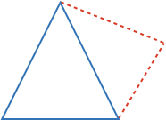
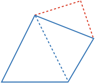
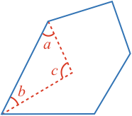
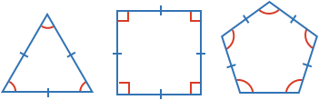
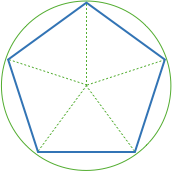
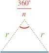

### Definition

*Polygon* is the general term that describes a shape made up of *straight sides*. A polygon has the same number of sides and angles.

The word comes from the Latin word _polygonum_, which comes from the Greek word _polygonos_ meaning "many-angled".

### Total Angle

We know a triangle's angles [[sum to a total]]((qr,'Math/Geometry_1/Triangles/base/AngleSum',#00756F)) of 180º.

You can make a triangle into a 4 sided shape by splitting one side into two.

Now, the total angle is the same as two triangles, or 360º.

Everytime you split a side into two, another triangle's total angle is added.

Splitting a side into two can either add to a shape (as above), or subtract from the shape (as below).

When subtracting from the shape, the total angle also increases by 180º.

Considering the above diagram, the total angle decreases by $$\definecolor{r}{RGB}{238,34,12}\definecolor{b}{RGB}{0,118,186}\color{r}a$$ and $$\color{r}b$$, and increases by the [[explementary]]((qr,'Math/Geometry_1/AngleGroups/base/Explementary',#00756F)) angle of $$\color{r}c$$:

$$total\ angle_{new} = total\ angle_{old} - \color{r}a \color{black}- \color{r}b \color{black}+360^\circ - \color{r}c$$

As $$\color{r}a$$, $$\color{r}b$$ and $$\color{r}c$$ add to 180º, then we have:

$$total\ angle_{new} = total\ angle_{old} + 180^\circ$$

So, more generally an $$\color{b}n$$-sided polygon will have a total angle of:

$$\bbox[10px,border:1px solid gray]{total\ angle = \left(\color{b}n\color{black}-2\right) \times 180^\circ}$$

Here $$2$$ is subtracted from $$\color{b}n$$ as the first three sides produce 180º, and then after that each additional side adds another 180º.

### Regular Polygons

A *regular polygon* is a polygon with equal sides and angles.

You can create a regular polygon from splitting a circle into equal pieces, then connecting the splits.

We know:

* Each piece is equal
* Therefore each angle at the circle center is equal
* The triangle sides that meet at the center are the radius

Therefore by [[SAS]]((qr,'Math/Geometry_1/CongruentTriangles/base/Sas',#00756F)) the triangles must be congruent and so all sides and angles of the polygon are equal.

### Regular Polygon Angle

From above, we know the total angle of a regular polygon is:

$$total\ angle = \left(\color{b}n\color{black}-2\right) \times 180^\circ$$

As each angle of a regular polygon is equal, then we can divide this by the number of angles to get the size of each angle:

$$angle = \frac{\left(\color{b}n\color{black}-2\right) \times 180^\circ}{\color{b}n}$$

This can be rearranged to

$$\bbox[10px,border:1px solid gray]{angle = 180^\circ - \frac{360^\circ}{\color{b}n}}$$

This tells us that as $$\color{b}n$$ gets larger, then so the angle must get closer and closer to 180º, but will always be less than 180º.

<!-- 
$$\definecolor{g}{RGB}{29,177,0}\definecolor{b}{RGB}{0,118,186}\definecolor{r}{RGB}{238,34,12}\definecolor{v}{RGB}{203,41,123}\defineColor{gr}{100,100,100}$$

### Example Image

### Example QR
[[here]]((qr,'Math/Geometry_1/Triangles/base/AngleSumPres',#00756F)) -->