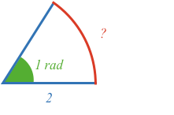
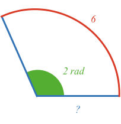
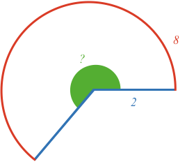
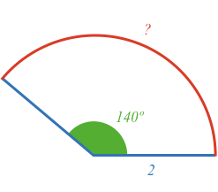

When angle is measured in Radians, the relationship between arc length, radius and angle is:

$$\definecolor{b}{RGB}{0,118,186}\definecolor{r}{RGB}{238,34,12}\definecolor{g}{RGB}{29,177,0} \color{r}arc\ length \color{black}= \color{g}angle \color{black} \times \color{b}radius$$

To convert angle between degrees and radians use:

$$degrees = \frac{180}{\pi} \times radians$$

$$radians = \frac{\pi}{180} \times degrees$$

### Example 1

What is the arc length that has a radius of 2, and an angle of 1 radian?

<hintLow>[Answer]
Substitute the values for radius and angle into the relationship between arc length, radius and angle at the top of the page:

$$\color{r}arc\ length \color{black}=2 \times 1 = \bbox[10px,border:1px solid gray]{2}$$
</hintLow>

### Example 2

What is the radius of an arc with length 6, and angle 2?

<hintLow>[Answer]
First rearrange the relationship between arc length, radius and angle:

$$\color{b}radius \color{black} = \frac{\color{r}arc\ length}{\color{g}angle}$$

Substitute in the values for arc length and angle

$$\color{b}radius \color{black} = \frac{6}{2} = \bbox[10px,border:1px solid gray]{3}$$
</hintLow>

### Example 3

What is the angle in degrees of an arc with radius 2 and arc length 8?

<hintLow>[Answer]
First rearrange the relationship between arc length, radius and angle:

$$\color{g}angle \color{black} = \frac{\color{r}arc\ length}{\color{b}radius}$$

Substitute in the values for arc length and radius

$$\color{g}angle \color{black} = \frac{8}{2} = 4\ rad$$

Convert angle to degrees:

$$degrees = \frac{180}{\pi} \times 4 = \bbox[10px,border:1px solid gray]{229^\circ}$$
</hintLow>

### Example 4

What is the arc length of an arc with angle 140º and radius 2?

<hintLow>[Answer]
First convert degrees to radians:

$$radians = \frac{\pi}{180} \times 140^\circ = 2.44\ rad$$

Then substitute the radius, and angle in radians, into the arc length relationship:

$$\color{r}arc\ length \color{black}=2 \times 2.44 = \bbox[10px,border:1px solid gray]{4.88}$$
</hintLow>