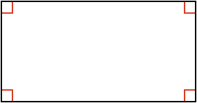
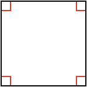

## Rectangle

A special type of [[quadrangle]]((qr,'Math/Geometry_1/Quadrangles/base/Main',#00756F)) is one where all the angles are **90º**. This shape is called a **rectangle**.

The word **rectangle** comes from the latin words _rectus_ which is _"right"_ and _angulus_ which is _"angle, corner"_.

## Side Relationships

A rectangle's opposite sides are parallel and equal. Can you prove this?

<hint>First prove they are parallel</hint>

<hint>To show they are parallel, use [[interior]]((qr,'Math/Geometry_1/AnglesAtIntersections/base/Interior',#00756F)) angles</hint>

<hint>You can use the [[AAS]]((qr,'Math/Geometry_1/CongruentTriangles/base/Aas',#00756F)) congruence test to show opposite sides are equal</hint>

<hintLow>[Answer]This lesson's [Explanation](/content/Math/Geometry_1/RectanglesAndSquares/explanation/base) shows the proof that opposite sides are parallel and equal</hintLow>

## Square

A special type of rectangle is one where **all sides are equal**. This shape is called a **square**.

The word **square** comes from the old French word _esquare_ which itself comes from the Latin word _quadra_, both of which mean _"square"_.
