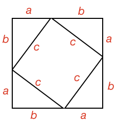

## Right Angle Triangles

### Definition

A triangle that has a right angle, is commonly called a **Right Angle Triangle** or **Right Triangle**.

The side opposite the right angle is called the **hypotenuse**.

The word _hypotenuse_ comes from the Greek word _hypoteinousa_ which means “stretching under”. Therefore the **hypotenuse is the side stretching under the right angle**.

The hypotenuse is always the longest side in a triangle. Can you show why this is?

<hint>Use the [[side angle relationship]]((qr,'Math/Geometry_1/SideAngleRelationship/base/Main',#00756F))  of a triangle</hint>

<hintLow>[Answer]
A triangle's [[total angle]]((qr,'Math/Geometry_1/Triangles/base/AngleSum',#00756F)) is always 180º. Therefore, if one angle is 90º, it must be the largest angle.

We also know that the longest side is [[always opposite the largest angle]]((qr,'Math/Geometry_1/SideAngleRelationship/base/Main',#00756F)) in a triangle. Therefore, the hypotenuse, which is opposite the right angle, is always the longest.

</hintLow>

### Area

What is the area of a right angle triangle?

<hint>What is the area if the base is one of the sides that is not the hypotenuse?</hint>

<hintLow>[Answer]
  [[Triangle angle]]((qr,'Math/Geometry_1/AreaTriangle/base/Main',#00756F)) is half the product of the base and height, where height is a perpendicular line from the base to the opposite vertex.

  This holds for a right angle triangle, but is simplified when the base is not the hypotenuse.

  As the two sides adjacent to the right angle are perpendicular, then they can be considered the base and height of the triangle:

  Thus area of a right angle triangle is **half the product of its perpendicular sides**.
</hintLow>

### Pythagorean Theorm

A right angle triangle's side lengths have a special relationship. This relationship was first attributed to Pythagorus over 2500 years ago, but it is likely it was known earlier than that.

Can you find a relationship between the lengths of the hypotenuse and the two other sides?

<hint>[Hint 1]Throughout history people have found many different proofs for this, but some of the easier ones involve creating a square with several congruent right angle triangle's then finding the areas of its parts</hint>

<hintLow>[Hint 2]

Here are two different ways to make squares with congruent right angle triangles:

</hintLow>

<hintLow>[Hint 3] Choose a diagram from the last hint and label all the sides of the triangles - keeping labels the same if the sides are the same length. Then calculate the area of the square formed by the hypotenuse of the right angle triangle.

For example, here is one of the configurations labelled:

</hintLow>

<hintLow>[Answer]

For a right angle triangle:

The relationship between sides is:

$$c^2 = a^2 + b^2$$

This is commonly known as the Pythagoean Theorem.

To see all the steps on how to get this, see this lesson's [Explanation](/content/Math/Geometry_1/RightAngleTriangles/explanation/base?page=11).

To see more proofs for this, see some of the external links in this lesson's [Links](/content/Math/Geometry_1/RightAngleTriangles/links/base) section.

</hintLow>

<!-- 

<hintLow>
Here are several triangles:

[[isosceles]]((qr,'Math/Geometry_1/Isosceles/base/Main',#00756F)) 

[Explanation](/content/Math/Geometry_1/SideAngleRelationship/explanation/base?page=23)

</hintLow>

 -->