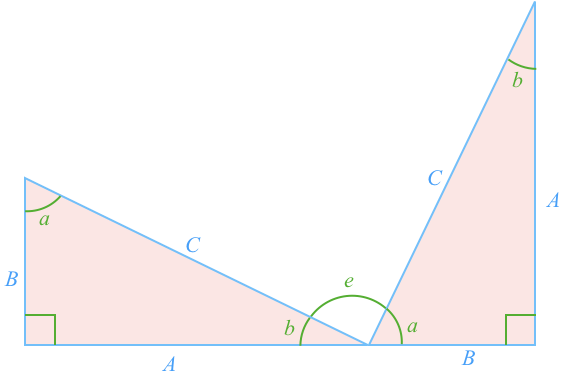

Start with a **Right Angled Triangle** that has side lengths $$\definecolor{b}{RGB}{0,118,186}\definecolor{g}{RGB}{29,177,0}\color{b}A$$, $$\color{b}{B}$$, and $$\color{b}{C}$$, and angles $$\color{g}{a}$$, $$\color{g}{b}$$ and $$\color{g}{90^\circ}$$:

As a triangle's angles [[add]]((qr,'Math/Geometry_1/Triangles/base/AngleSumPres',#00756F)) to 180º, and one angle is $$\color{g}{90^\circ}$$, then the remaining angles must be $$\color{g}{180^\circ-90^\circ = 90^\circ}$$.

Therefore $$\color{g}{a} + \color{g}{b} = 90^\circ$$.

Rotate a copy of the triangle so the sides $$\color{b}A$$ and $$\color{b}B$$ form a straight line:

As $$\color{b}A$$ and $$\color{b}B$$ are a straight line, angles $$\color{g}{a}$$, $$\color{g}{b}$$ and $$\color{g}{e}$$ are [[supplementary]]((qr,'Math/Geometry_1/AngleGroups/base/Supplementary',#00756F)).

We know $$\color{g}{a} + \color{g}{b} = 90^\circ$$ and $$\color{g}{a} + \color{g}{b} + \color{g}{e} = 180^\circ$$, so therefore $$\color{g}{e}=90^\circ$$.

Copy the original triangle two more times to create a large square. Each angle between the triangles can be shown the same way to be a right angle.

The side length of the large square is $$\color{b}A+B$$ and so the [[area]]((qr,'Math/Geometry_1/Area/base/Square',#00756F)) is $$\color{b}\(A+B\)^2$$.

As $$\color{b}e$$ is a right-angle, then the inside shape is also a square with area $$\color{b}C^2$$.

Each right angle triangle has an [[area]]((qr,'Math/Geometry_1/RightAngleTriangles/base/Area',#00756F)) of $$\color{b}\textstyle{\frac{1}{2}}AB$$.

The large square's area is the sum of the four triangles and the smaller square:

$$\color{b}\(A+B\)^2 = 4\textstyle{\frac{1}{2}}AB + C^2$$

Expanding out the left side and simplifying the right:

$$\color{b} A^2 + 2AB + B^2 = 2AB + C^2$$

Subtract $$\color{b}2AB$$ from both sides:

$$\color{b} \bbox[20px,border:1px solid red]{A^2 + B^2 = C^2}$$

And so for a right angle triangle the sum of the squares of the [[perpendicular]]((qr,'Math/Geometry_1/AngleTypes/base/Perpendicular',#00756F)) sides is equal to the square of the [[hypotenuse]]((qr,'Math/Geometry_1/RightAngleTriangles/base/Hypotenuse',#00756F)). This can also be visulaized as squares made from the edges of the right angle triangle:

