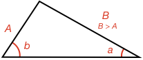
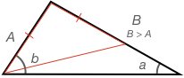
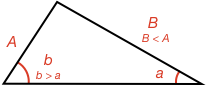

If you draw many different triangles with angles that are both large and small, you might start to see a relationship between the opposite sides and angles. Can you see it?

<hintLow>
Here are several triangles:

</hintLow>

<hint>Which is the largest angle and side? Which is the smallest?</hint>

<hintLow>[Answer]
The angle opposite the longest side is always largest, while the angle opposite the shortest side is always the smallest.
</hintLow>

If one side is longer than another, can you prove which angle opposite the sides will be larger?

<hintLow>Start with a triangle where one side is clearly longer than the other and mark the opposite angles

</hintLow>

<hintLow>Draw an [[isosceles]]((qr,'Math/Geometry_1/Isosceles/base/Main',#00756F))  triangle along sides A and B such that the equal sides equal A

</hintLow>

<hint>Use the [[isosceles]]((qr,'Math/Geometry_1/Isosceles/base/Main',#00756F)) triangle and [[external]]((qr,'Math/Geometry_1/ExternalAngles/base/External',#00756F)) angle of a triangle relationships to find relationships between angles and see which ones are largest</hint>

<hintLow>[Answer]
  The answer can be seen in detail in this lesson's [Explanation](/content/Math/Geometry_1/SideAngleRelationship/explanation/base?page=3)
</hintLow>

How about the converse, if one angle is longer than another, can you prove which side opposite the angles will be larger?

<hintLow>Try starting with a triangle where one angle (b) is larger than another (a) but then assume that B $$\le$$ A.

</hintLow>

<hint>If B = A, does this lead to a result that is inconsistent with the given condition b > a?</hint>

<hint>What about if B < A</hint>

<hint>If both B = A and B < A leads to results inconsistent with the given condition, then we can say the initial assumption is wrong</hint>

<hintLow>[Answer]
  The answer can be seen in detail in this lesson's [Explanation](/content/Math/Geometry_1/SideAngleRelationship/explanation/base?page=23)
</hintLow>
