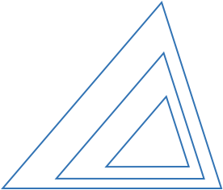
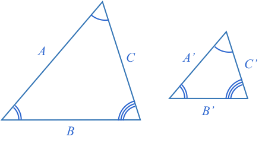
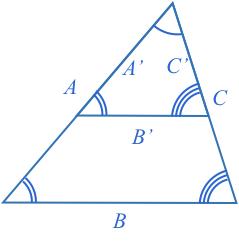
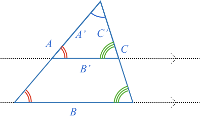
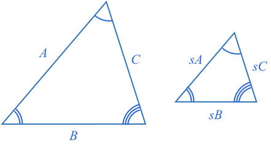
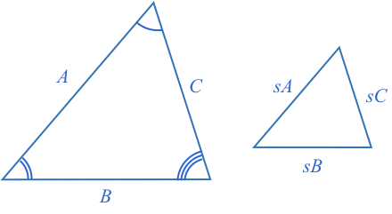
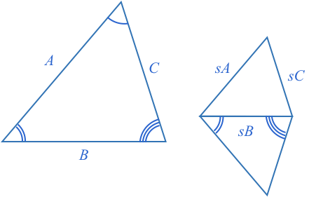
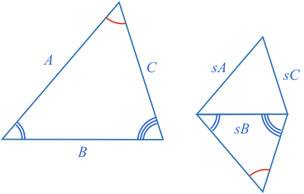
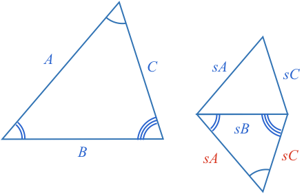
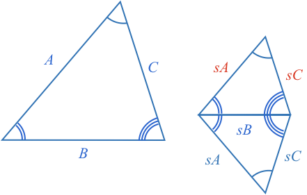

### Similar Triangles

**Similar** shapes are those that have the same shape but are a different size.

To resize a shape, all its sides must be scaled by the same scaling factor.

Thus, **similar triangles** are triangles whose corresponding sides are all in the same proportion, or are all scaled by the same amount.

Do you notice any common characteristics of the angles of each similar triangle above?

<hintLow>[Answer]
    All triangles seem to have equal corresponding angles.
</hintLow>

### Are Triangles with Equal Corresponding Angles Similar?

Can you show that all triangles with equal corresponding angles are similar triangles?

<hintLow> Start by drawing two triangles of different size, but with equal corresponding angles.

</hintLow>

<hintLow>
Align one of the corresponding angles of the triangles.

</hintLow>

<hint>Can you show that $$\definecolor{b}{RGB}{0,118,186}\color{b}B$$ is parallel with $$\color{b}B’$$?</hint>

<hintLow>
The angles formed from side $$\color{b}A$$ intersecting sides $$\color{b}B$$ and $$\color{b}B’$$ are equal [[corresponding angles]]((qr,'Math/Geometry_1/AnglesAtIntersections/base/Corresponding',#00756F)) . Therefore, the lines $$\color{b}B$$ and $$\color{b}B’$$ must be parallel.

</hintLow>

<hint>Use knowledge of what happens when a [[parallel line splits a triangle]]((qr,'Math/Geometry_1/ParallelSplitOfTriangle/base/TrianglePres',#00756F)).</hint>

<hintLow>
When a parallel line splits a triangle, the triangle formed is proportional to the original. Therefore each of the smaller sides is scaled by the same factor.

This is the definition of a similar triangle, so we have shown that all triangles with equal corresponding sides are similar.

</hintLow>

### Do Similar Triangles have Equal Corresponding Angles?

Can you show that all similar triangles have equal corresponding angles?

<hintLow>
Start by drawing two similar triangles - can you find the angles of the one on the right?

</hintLow>

<hintLow>
Build a triangle off one of the smaller triangles sides, that shares the angles adjacent to the corresponding side of the larger triangle.

</hintLow>

<hint>Find the third angle of the new triangle.</hint>

<hintLow>
As the angles in a triangle always [[add to 180º]]((qr,'Math/Geometry_1/Triangles/base/AngleSumPres',#00756F)), then if you know two angles there can only be one third angle. Therefore both triangles must share the same third angle as well.

</hintLow>

<hintLow>
Both triangles share the same angles, therefore they must be similar. Can you fill in the side lengths of the new triangle?

</hintLow>

<hint>Use knowledge of [[SSS triangle congruence]]((qr,'Math/Geometry_1/CongruentTriangles/base/Sss',#00756F)).</hint>

<hintLow>
The two triangles on the right share the same side lengths, and therefore from [[SSS triangle congruence]]((qr,'Math/Geometry_1/CongruentTriangles/base/Sss',#00756F)) they must be congruent.

As they are congruent, they also share the same corresponding angles.

And now we see the original too similar triangles also share the same angles.

</hintLow>
