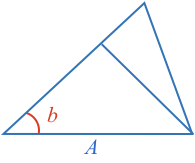
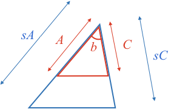

### Similar Triangles

**Similar** shapes are those that have the same shape but are a different size.

To resize a shape, all its sides must be scaled by the same scaling factor.

Thus, **similar triangles** are triangles whose corresponding sides are all in the same proportion, or are all scaled by the same amount.

Do you notice any common characteristics of the angles of each similar triangle above?

<hintLow>[Answer]
    All triangles seem to have equal corresponding angles.
</hintLow>

### Are Triangles with Equal Corresponding Angles Similar?

Can you show that all triangles with equal corresponding angles are similar triangles?

<hintLow> Start by drawing two triangles of different size, but with equal corresponding angles.

</hintLow>

<hintLow>
Align one of the corresponding angles of the triangles.

</hintLow>

<hint>Can you show that $$\definecolor{b}{RGB}{0,118,186}\color{b}B$$ is parallel with $$\color{b}B’$$?</hint>

<hintLow>
The angles formed from side $$\color{b}A$$ intersecting sides $$\color{b}B$$ and $$\color{b}B’$$ are equal [[corresponding angles]]((qr,'Math/Geometry_1/AnglesAtIntersections/base/Corresponding',#00756F)) . Therefore, the lines $$\color{b}B$$ and $$\color{b}B’$$ must be parallel.

</hintLow>

<hint>Use knowledge of what happens when a [[parallel line splits a triangle]]((qr,'Math/Geometry_1/ParallelSplitOfTriangle/base/Triangle',#00756F)).</hint>

<hintLow>
When a [[parallel line splits a triangle]]((qr,'Math/Geometry_1/ParallelSplitOfTriangle/base/Triangle',#00756F)), the triangle formed is proportional to the original. Therefore each of the smaller sides is scaled by the same factor.

This is the definition of a similar triangle, so we have shown that all triangles with equal corresponding sides are similar.

</hintLow>

### Do Similar Triangles have Equal Corresponding Angles?

Can you show that all similar triangles have equal corresponding angles?

<hintLow>
Start by drawing two similar triangles - can you find the angles of the one on the right?

</hintLow>

<hintLow>
Build a triangle off one of the smaller triangles sides, that shares the angles adjacent to the corresponding side of the larger triangle.

</hintLow>

<hint>Find the third angle of the new triangle.</hint>

<hintLow>
As the angles in a triangle always [[add to 180º]]((qr,'Math/Geometry_1/Triangles/base/AngleSumPres',#00756F)), then if you know two angles there can only be one third angle. Therefore both triangles must share the same third angle as well.

</hintLow>

<hintLow>
Both triangles share the same angles, therefore they must be similar. You can therefore fill in the side lengths of the new triangle.

If you can show the new triangle and the small triangle are congruent, then their corresponding angles will be equal.
</hintLow>

<hint>Use knowledge of [[SSS triangle congruence]]((qr,'Math/Geometry_1/CongruentTriangles/base/Sss',#00756F)).</hint>

<hintLow>
The two triangles on the right share the same side lengths, and therefore from [[SSS triangle congruence]]((qr,'Math/Geometry_1/CongruentTriangles/base/Sss',#00756F)) they must be congruent.

As they are congruent, they also share the same corresponding angles.

And now we see the original two similar triangles also share the same corresponding angles.

</hintLow>

### Testing if Triangles are Similar

Two ways to determine if two triangles are similar is to either:

* Measure all sides and confirm corresponding sides have the same proportion
* Measure all angles and confirm corresponding angles are equal

Both ways do not require you to know all sides AND angles of both triangles. Thus if you know two triangles are similar, unknown properties of one triangle may be inferred from corresponding known properties of the other.

It is useful to know what combinations of properties can determine if two triangles are similar.

### One Property

If you just know a single side or angle, is that enough to know whether two triangles are similar?

<hintLow>

Another way to ask this is: if you fix one side (or angle), how many different triangles can you make?

If the answer is just one, then you know if two triangles have one side (or angle) that is the same measure then they will be similar.

If on the other hand you can make triangles with different angles, then you know you won't be able to use this property to determine if two triangles are similar.

This is because if all similar triangles have equal corresponding angles, then there can be no triangles with unequal corresponding angles that are similar.
</hintLow>

<hint>Try drawing a side or angle - how can you build more than one triangle off that first property?</hint>

<hint>A similar exercise was done with [congruent triangles](/content/Math/Geometry_1/CongruentTriangles/discover/simple).</hint>

<hintLow>[Answer]
The diagram below shows two triangles with different angles being created from fixing just one side or angle. Therefore one property is not sufficient to determine similarity.

</hintLow>

### Two Properties

What about if you know two properties? Firstly, what are the different combinations of properties? One combination is two sides, what are the others?

<hintLow>[Answer]

The unique combinations of two properties are:
* adjacent side angle
* opposite side angle
* two sides
* two angles

</hintLow>

Are any of these combinations suffient to determine if two triangles are congruent?

<hint>This interactive triangle might be helpful to experiment with [here](/content/Math/Geometry_1/CongruentTriangles/ta/tri). You can move its vertices and see how the side lengths and angles change.</hint>

<hint>The diagram from the answer in **One Property** can be used for the "Adjacent side angle" case.</hint>

<hintLow>[Answer - Adjacent side angle]
We can use the same diagram from the "One Property" answer to see that an adjacent side and angle can create more than one triangle, and is therefore insufficient for a similarity test.

</hintLow>

<hintLow>[Answer - Opposite side angle]
Below is a diagram showing two triangles that can be formed using the same side and opposite angle. So this cannot be used as a similarity test.

</hintLow>

<hintLow>[Answer - Two sides]
Below is a diagram showing two triangles that can be formed using the same two adjacent sides. So this cannot be used as a similarity test.

</hintLow>

<hintLow>[Answer - Two angles]
We know that the sum of a triangle's angles [[always equals 180º]]((qr,'Math/Geometry_1/Triangles/base/AngleSum',#00756F)). Therefore anytime you know two angles, you can always calculate the third, meaning that knowing two angles is as good as knowing three angles.

Therefore, knowing two angles in two triangles is sufficient information to know if they are similar or not.

This is often referred to as the **AA** similarity test.
</hintLow>

### Three Properties

What about if you know three properties? Firstly, what are the different combinations of properties? One combination is three sides, what are the others?

<hintLow>[Answer]
There are six combinations. Combinations are typlically denoted property-property-property or PPP where order is how they appear in the triangle.

For example, if you have two angles and a side, it could either be side-side-angle (SSA) or side-angle-side (SAS). The SAS combination would consist of an angle between two sides like:

whereas SSA would be an angle adjacent to just one of the sides:

The six combinations are:

* side-side-side (SSS)
* angle-angle-angle (AAA)
* side-side-angle (SSA)
* side-angle-side (SAS)
* angle-angle-side (AAS)
* angle-side-angle (ASA)

Note, we have already discussed that SSS and AAA are sufficient to determine similarity, so they won't be covered again.

</hintLow>

Are any of these combinations suffient to determine if two triangles are similar?

<hint>The AA similarity test already covers some of the combinations</hint>

<hintLow>[Answer - AAS]
    This case is a superset of **AA**, and therefore it is possible, but the side is unnecessary.
</hintLow>

<hintLow>[Answer - ASA]
    This case is a superset of **AA**, and therefore it is possible, but the side is unnecessary.
</hintLow>

<hint>[Hint - SAS] Start by drawing two triangles with two corresponding sides in propotion surrounding one angle.</hint>

<hint>[Hint - SAS] Try lining up the triangles so the equal angles are aligned.</hint>

<hint>[Hint - SAS] Remember that when two sides of a triangle are [[split in equal proportion]]((qr,'Math/Geometry_1/ParallelSplitOfTriangle/base/ProportionalSplit',#00756F)), the line between the splits is parallel to the remaining side.</hint>

<hint>[Hint - SAS] Also remember that when a triangle is [[split by a parallel line]]((qr,'Math/Geometry_1/ParallelSplitOfTriangle/base/Triangle',#00756F)), the split triangle's corresponding sides have the same proportion to the original triangle.</hint>

<hintLow>[Answer - SAS]

The SAS case can be considered with the aid of a diagram. Start by aligning the known angle of both triangles. If the known corresponding sides are both of equal propotion, then we have a case where we have [[split a triangle in equal proportion]]((qr,'Math/Geometry_1/ParallelSplitOfTriangle/base/Triangle',#00756F)). In such a case, the remaining corresponding sides are parallel, and therefore all sides of the two triangles have the [[same proportion]]((qr,'Math/Geometry_1/ParallelSplitOfTriangle/base/Triangle',#00756F)). Therefore they are similar.

</hintLow>

<hint>[Hint - SSA]It might be useful to review the [SSA test for congruent triangles](/content/Math/Geometry_1/CongruentTriangles/explanation/base?page=55)</hint>

<hintLow>[Answer - SSA]
SSA can be used to test for similarity only if the known side opposite the known angle is longer than or equal to the known side adjacent to the angle.

This topic's explanations of this topic have both a [descriptive](/content/Math/Geometry_1/SimilarTriangles/explanation/static) reasoning for this, as well as more [succinct](/content/Math/Geometry_1/SimilarTriangles/explanation/staticBrief) reasoning.
</hintLow>