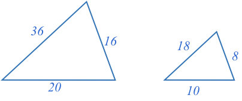
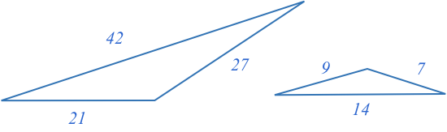
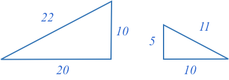
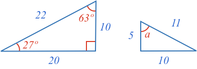
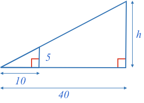
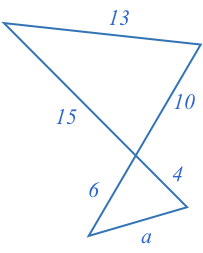
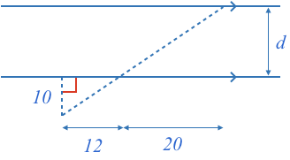
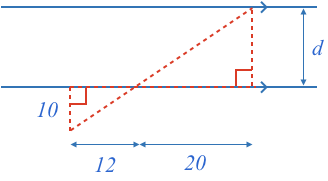

### Example 1

Are the two triangles below similar?

<hintLow>[Answer]
Triangles that have corresponding sides in equal proportion are similar.

In this case, the smaller triangle's sides are all half the length of the larger triangle's corresponding sides. Therefore, they all have the same proportion, and the triangles are similar.
</hintLow>

### Example 2

Are the two triangles below similar?

<hintLow>[Answer]
Triangles that have corresponding sides in equal proportion are similar.

In this case, one triangle is rotated compared to the other, but the corresponding sides of the smaller triangle are all one third of the larger. Therefore, the triangles are similar.
</hintLow>

### Example 3

Are the two triangles below similar?

<hintLow>[Answer]
Triangles that have corresponding sides in equal proportion are similar.

In this case, one triangle is flipped compared to the other, but the corresponding sides of the smaller triangle are all one half of the larger. Therefore, the triangles are similar.
</hintLow>

### Example 4

What is the measure of angle $$\definecolor{r}{RGB}{238,34,12}\definecolor{b}{RGB}{0,118,186}\color{r}a$$ in degrees?

<hintLow>[Answer]
Triangles that have corresponding sides in equal proportion are similar.

All similar triangles have equal corresponding angles.

The two triangles are similar as the smaller triangle's sides are all half the length of the corresponding sides of the larger triangle.

Therefore, as both triangles have the same corresponding angles, the unknown angle $$\color{r}a$$ must be:

$$\bbox[10px,border:1px solid gray]{\color{r}a \color{black} = 63^\circ}$$

</hintLow>

### Example 5

What is the height $$\color{b}h$$?

<hintLow>[Answer]
Here we recognize that the two right angles are equal [[corresponding angles]]((qr,'Math/Geometry_1/AnglesAtIntersections/base/Corresponding',#00756F)), and therefore the lines representing the heights of each triangle ($$\color{b}5$$ and $$\color{b}h$$) are parallel to each other.

[[Triangles split with a parallel line]]((qr,'Math/Geometry_1/ParallelSplitOfTriangle/base/Triangle',#00756F)) form an equally proportioned, and therefore similar, smaller triangle.

To find the proportion, or scaling factor of the two similar triangles we can use the base of both triangles:

$$\frac{40}{10} = 4$$

Therefore, all sides of the larger triangle will be 4 times the length of the smaller.

As the height of the smaller triangle is 5, then the height of the larger triangle will be:

$$\bbox[10px,border:1px solid gray]{\color{b}h \color{black} = 4\times5 = 20}$$

</hintLow>

### Example 6

What is the length of side $$\color{b}a$$?

<hintLow>[Answer]
The middle angles where the two triangles meet is an [[opposite angle]]((qr,'Math/Geometry_1/AnglesAtIntersections/base/Opposite',#00756F)), which means both angles are equal.

We also know that the two corresponding known sides of each triangle have equal proportion. The larger triangles sides are 2.5 times larger than the smaller triangle.

Therefore, we can use the SAS similarity test to confirm both triangles are similar.

As both triangles are similar, and we know the proportionality factor is 2.5, then the unknown side must be:

$$\bbox[10px,border:1px solid gray]{\color{b}h \color{black} = \frac{13}{2.5} = 5.2}$$

</hintLow>

### Example 7

What is the distance $$\color{b}d$$ between the parallel lines?

<hintLow>[Answer]

First note that the [[distance between the parallel lines]]((qr,'Math/Geometry_1/ParallelLineDistance/base/Main',#00756F)) is the length of the line perpendicular to the lines.

Next we can draw in some lines to highlight the two triangles in the diagram.

Now, both triangles are similar as they both share two equal angles (the AA similarity test):

* the right angle
* the [[opposite angle]]((qr,'Math/Geometry_1/AnglesAtIntersections/base/Opposite',#00756F)) where there two vertices touch

The proportionality factor, or scaling factor between the two triangles is

$$\frac{20}{12}=1.67$$

Therefore, the distance between the parallel lines is:

$$\bbox[10px,border:1px solid gray]{\color{b}h \color{black} = 10 * 1.67 = 16.7}$$

</hintLow>

<!-- What is the size of angle $$\definecolor{r}{RGB}{238,34,12}\bbox[10px,border:1px solid gray]{a}$$ in degrees? -->
<!-- 

<hintLow>[Answer]
[[triangle]]((qr,'Math/Geometry_1/Triangles/base/AngleSum',#00756F)) 
</hintLow>

 $$\bbox[10px,border:1px solid gray]{Yes}$$ -->