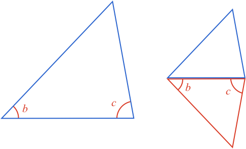
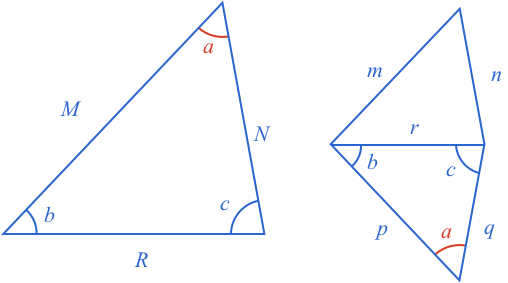
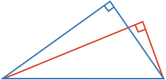
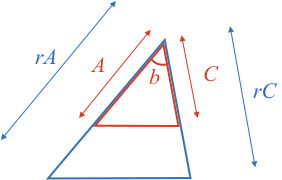
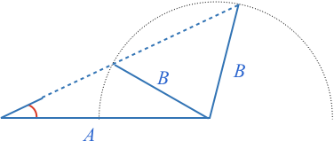
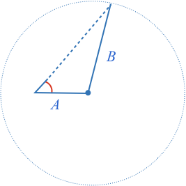
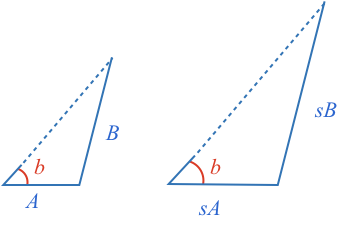
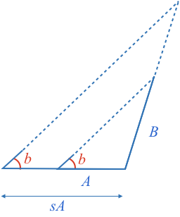
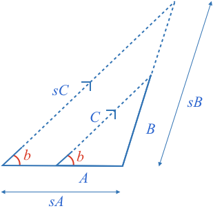

### Definition

**Similar** shapes are those that have the same shape but are a different size.

**Similar** triangles have the same corresponding angles and their corresponding sides are the same proportion.

### Triangles with Equal Corresponding Angles are Similar - Proof

Two triangles that have the same angles can be different sizes.

However, while the sizes may be different, the sizes are still related. Specifically, all pairs of corresponding sides have the same ratio.

We can prove this by overlaying one triangle on the other.

The first observation we can make is the two $$\definecolor{b}{RGB}{0,118,186}\definecolor{r}{RGB}{238,34,12}\color{b}b$$ angles are **equal** and [[corresponding angles]]((qr,'Math/Geometry_1/AnglesAtIntersections/base/Corresponding',#00756F)). This means the two horizontal lines are **parallel**.

When a triangle is [[split]]((qr,'Math/Geometry_1/ParallelSplitOfTriangle/base/Triangle',#00756F)) with a parallel line, the smaller triangle's sides will all be scaled by the same proportion.

**Therefore if triangles share the same angles, then their corresponding sides have the same proportion, and they are similar triangles**.

### Similar Triangles have Equal Corresponding Angles - Proof

Now what happens if we know two triangles have corresponding sides that are proportional. Are their corresponding angles equal, and therefore are they similar?

We start with two triangles whose corresponding sides are in proportion.

This means each ratio of corresponding sides is the same:

$$\color{b}\frac{M}{m}=\frac{R}{r}\ \ \ \ \ \ \ \ \ \ \frac{M}{m}=\frac{N}{n}\ \ \ \ \ \ \ \ \ \ \frac{R}{r}=\frac{N}{n}$$

Rearranging each of these, we can see it also means the ratio of adjacent sides of one triangle is equal to the ratio of the corresponding adjacent sides of the other.

$$\color{b}\frac{M}{R}=\frac{m}{r}\ \ \ \ \ \ \ \ \ \ \frac{M}{N}=\frac{m}{n}\ \ \ \ \ \ \ \ \ \ \frac{R}{N}=\frac{r}{n}$$

Now, do such triangles have equal corresponding angles? We can look at this by drawing a third triangle that shares a side with side $$\color{b}r$$, and has the angles $$\color{b}b$$ and $$\color{b}c$$ from the larger triangle.

Now as both the new triangle, and large triangle have two angles defined, and a triangles angles [[add to 180º]]((qr,'Math/Geometry_1/Triangles/base/AngleSum',#00756F)), then their third angle must be the same.

We have seen above that when two triangles share the same angles, then they are similar triangles. Therefore their sides have the same proportion:

$$\color{b}\frac{M}{R}=\frac{p}{r}\ \ \ \ \ \ \ \ \ \ \frac{M}{N}=\frac{p}{q}\ \ \ \ \ \ \ \ \ \ \frac{R}{N}=\frac{r}{q}$$

But we started with:

$$\color{b}\frac{M}{R}=\frac{m}{r}\ \ \ \ \ \ \ \ \ \ \frac{M}{N}=\frac{m}{n}$$

Therefore:

$$\color{b}m=p\ \ \ \ \ \ \ \ \ \ n=q$$

Now, the two small triangles share three side lengths, meaning they are [[congruent]]((qr,'Math/Geometry_1/CongruentTriangles/base/Sss',#00756F)), and therefore have the same angles.

And so **two triangles whose corresponding sides are in proportion have equal angles and are therefore similar**.

### Testing for Similarity

As similar triangles have proportional sides, and equal corresponding angles, you can often infer unknown side lengths or angles if know two triangles are similar. 

How many properties do you need to know to confirm two triangles are similar?

Another way to ask this is, what are the properties you need to confirm two triangles will have the same corresponding angles. As all similar triangles have the same corresponding angles, if you can show a set of properties can create a triangle with only one set of angles, then you know they will be sufficient to determine similarity.

#### One Property

When we did the same exercise for [[congruent triangles]]((qr,'Math/Geometry_1/CongruentTriangles/base/Sss',#00756F)), we saw one angle or one side could create many different shapes and sizes of triangles. For example, the diagram below shows two triangles with different angles being created from fixing just one side or angle.

Thus knowing just one property is insufficient to deterime two triangles are similar.

#### Two Properties

What about two properties? The combination of two property pairs are:

* Side, Adjacent Angle
* Side, Opposite Angle,
* Side, Side
* Angle, Angle

Actually, we can use the first diagram again to show that knowing one side and an adjacent angle in insufficient.

Similarly, knowing one side and an opposite angle is insufficient as the following diagram shows two triangles with different angles.

Both triangles share a base and opposite angle, but have clearly different remaining angles.

We can also come up with a scenario where two triangles share two adjacent sides but have different angles. 

In the above case two triangles are made that share a vertex as the center of a circle. The blue triangle has all acute angles, while the red has an obtuse angle.

Next we consider the case of knowing **two angles**. We know that all the angles of a triangles [[add to 180º]]((qr,'Math/Geometry_1/Triangles/base/AngleSum',#00756F)), therefore if you know two triangles there can only be one angle that adds to these to make 180º.

**Therefore, if you know two angles, you effectively know all three angles, and it is therefore sufficient to determine if two triangles are similar.**

Note, you don't even need to know two corresponding angles of two triangles. You can calculate the remaining angle for both triangle and then determine if they are similar.

#### Three Properties

Next we consider three properties. The combinations of three properties are:

* Angle Angle Angle (AAA)
* Angle Side Angle (ASA)
* Angle Angle Side (AAS)
* Side Side Side (SSS)
* Side Angle Side (SAS)
* Side Side Angle (SSA)

We already know all combinations of sides (SSS) or all combinations of angles (AAA) is sufficient to determine similarity as they are the definition of similarity.

We also already know all combinations with at least two angles will be sufficient. Therefore ASA and AAS are sufficient.

The SAS case can be considered with the aid of a diagram. Start by aligning the known angle of both triangles. If the known corresponding sides are both of equal propotion, then we have a case where we have [[split a triangle in equal proportion]]((qr,'Math/Geometry_1/ParallelSplitOfTriangle/base/ProportionalSplit',#00756F)). In such a case, the remaining corresponding sides are parallel, and therefore all sides of the two triangles have the [[same proportion]]((qr,'Math/Geometry_1/ParallelSplitOfTriangle/base/Triangle',#00756F)). Therefore they are similar.

**Therefore if two triangles share the same angle and adjacent proportional corresponding sides, they will be similar.**

Finally, lets consider the SSA case. Assume you have two triangles with two proportional corresponding sides and an equal angle adjacent to just one of the sides. We already know from [[SSA triangle congruence]]((qr,'Math/Geometry_1/CongruentTriangles/base/Ssa',#00756F)) that when the side opposite to the known angle is shorter than the adjacent side, two different triangles can be made. Both have different angles, and therefore it will not be enough to determine similarity.

We also know from [[SSA triangle congruency]]((qr,'Math/Geometry_1/CongruentTriangles/base/Ssa',#00756F)) that when the side opposite to the known angle is greater than or equal to the adjacent side, then only one triangle can be constructed, and therefore SSA is a sufficient test for congruency.

So let's assume we have two triangles that share the same angle, have corresponding sides in proportion, and the side opposite the known angle is greater than the adjacent side, or $$\color{b}B\color{black}\gt\color{b}A$$.

First, take the smaller triangle and extend side A to be the same size as the larger triangle

Now, as the two corresponding angles $$\color{r}b$$ are equal, then the two dashed lines adjacent to the $$\color{r}b$$ angles must be [[parallel]]((qr,'Math/Geometry_1/AnglesAtIntersections/base/Corresponding',#00756F)).

Therefore, we have a case where the larger triangle is split with a line parallel to one of its sides, resulting in a smaller triangle where all sides are split with the same ratio, and therefore the larger and smaller triangles are similar.

As we already know the ratio for one of the sides is $$\color{b}r$$, then so it must be for all sides.
 
 

 The large triangle shares the same [[SSA]]((qr,'Math/Geometry_1/CongruentTriangles/base/Ssa',#00756F)) configuration as the initial large triangle. As we started with the knowledge that $$\color{b}rB \color{black}\gt \color{b}rA$$, we can say the two large triangles are congruent and therefore the initial large triangle is similar to the initial small triangle.

 As [[SSA triangle congruency]]((qr,'Math/Geometry_1/CongruentTriangles/base/Ssa',#00756F)) also holds when the two known sides are equal, then we can follow the same procedure to show that SSA is sufficient to show similarity when the two sides are the same length.

 We can also recognize that when two sides share the same length, we have an [[isosceles triangle]]((qr,'Math/Geometry_1/Isosceles/base/Main',#00756F)). When you know one angle of an isosceles triangle, you can calculate all other angles of the isosceles triangle, and thus you also meet the AA similarity tests.

 **Therefore, if you know two triangles have two sides in equal proportion, and they have an equal angle adjacent to the same corresponding side, you will know they are similar.**

### Summary

Similar triangles are triangles whose corresponding sides are all in proportion, or scaled by the same factor

All similar triangles have the equal corresponding angles

All triangles with equal corresponding angles have corresponding sides in proportion and are therefore similar.

You can tell if two triangles are similar with the following similarity tests:

* AA (and by extension AAA)
* ASA
* SSS
* SSA (only when the side opposite the known angle is longer than or equal to the adjacent side).

