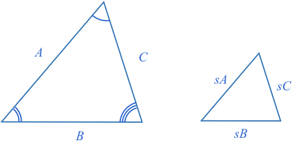
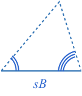
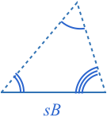
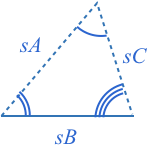

### Definition

**Similar** shapes are those that have the same shape but are a different size.

**Similar** triangles have the same corresponding angles and their corresponding sides have the same proportion (have the same scaling factor).

### Triangles with Equal Corresponding Angles are Similar - Proof

Two triangles that have the same angles can be different sizes.

However, while the sizes may be different, the sizes are still related. Specifically, all pairs of corresponding sides have the same scaling factor.

We can prove this by overlaying one triangle on the other.

The first observation we can make is the two $$\definecolor{b}{RGB}{0,118,186}\definecolor{r}{RGB}{238,34,12}\color{b}b$$ angles are [[equal corresponding angles]]((qr,'Math/Geometry_1/AnglesAtIntersections/base/Corresponding',#00756F)). This means the two horizontal lines are **parallel**.

When a [[triangle is split with a parallel line]]((qr,'Math/Geometry_1/ParallelSplitOfTriangle/base/Triangle',#00756F)), the smaller triangle's sides will all be scaled by the same factor.

**Therefore if triangles share the same angles, then their corresponding sides are scaled by the same factor, and they are similar triangles**.

### Similar Triangles have Equal Corresponding Angles - Proof

Now what happens if we know two triangles similar. Are their corresponding angles equal as well?

We start with two similar triangles:

Now, lets construct a third triangle with the base angles of the large triangle, and the base length of the small triangle.

As we know [[all angles in a triangle add to 180º]]((qr,'Math/Geometry_1/Triangles/base/AngleSum',#00756F)), then if we know two angles, there can only be one angle possible third angle.

Therefore, the third angle must also be the same as the top angle of the large triangle.

The new triangle and original large triangle have equal corresponding angles, and are therefore similar. As the new triangle's base side is scaled by $$\color{b}s$$ compared to the large triangle, then all sides must be scaled by the same factor.

This new triangle shares all the same side lengths as the original small triangle. From [[SSS triangle congruence]]((qr,'Math/Geometry_1/CongruentTriangles/base/Sss',#00756F)), these triangles are congruent and therefore their corresponding angles are the same.

Therefore, the two original similar triangles have equal corresponding angles, and as these were generalized triangles, we can say that **all similar triangles have equal corresponding angles**.

### Testing for Similarity

As similar triangles have proportional sides, and equal corresponding angles, you can often infer unknown side lengths or angles if know two triangles are similar. 

How many properties do you need to know to confirm two triangles are similar?

Another way to ask this is, what are the properties you need to know to confirm two triangles will have the same corresponding angles. As all similar triangles have the same corresponding angles, if you can show a set of properties can create a triangle with only one set of angles, then you know they will be sufficient to determine similarity.

### One Property

When we did the same exercise for [[congruent triangles]]((qr,'Math/Geometry_1/CongruentTriangles/base/Sss',#00756F)), we saw one angle or one side could create many different shapes and sizes of triangles. For example, the diagram below shows two triangles with different angles being created from fixing just one side or angle.

Thus knowing just one property is insufficient to deterime two triangles are similar.

### Two Properties

What about two properties? The combination of two property pairs are:

* Adjacent side angle
* Opposite side angle,
* Side side
* Angle angle

Actually, we can use the first diagram again to show that knowing an adjacent side and angle is insufficient.

Similarly, knowing one side and an opposite angle is insufficient as the following diagram shows:

Both triangles share a base and opposite angle, but have clearly different remaining angles.

We can also come up with a scenario where two triangles share two adjacent side lengths but have different angles. 

In the above case two triangles are made that share a base, share a vertex as the center of a circle, and use the radius of the circle as one of their sides. The blue triangle has all acute angles, while the red has an obtuse angle.

Next we consider the case of knowing **two angles**. We know that all the angles of a triangle [[add to 180º]]((qr,'Math/Geometry_1/Triangles/base/AngleSum',#00756F)), therefore if you know two angles you can calculate the third.

**If you know two angles, you effectively know all three angles, and three angles is sufficient to determine if two triangles are similar.**

Note, you don't even need to know two corresponding angles of two triangles. You can calculate the remaining angle for both triangles and then determine if they are similar.

### Three Properties

Next we consider three properties. The combinations of three properties are:

* Angle Angle Angle (AAA)
* Angle Side Angle (ASA)
* Angle Angle Side (AAS)
* Side Side Side (SSS)
* Side Angle Side (SAS)
* Side Side Angle (SSA)

We already know all combinations of sides (SSS) or all combinations of angles (AAA) is sufficient to determine similarity as they are the definition of similarity.

We also already know all combinations with at least two angles will be sufficient. Therefore ASA and AAS are sufficient.

The SAS case can be considered with the aid of a diagram. Start by aligning the known angle of both triangles. If the known corresponding sides both have the same scaling factor, then we have a case where we have [[split a triangle in equal proportion]]((qr,'Math/Geometry_1/ParallelSplitOfTriangle/base/ProportionalSplit',#00756F)). In such a case, the remaining corresponding sides are parallel, and therefore all sides of the two triangles have the [[same proportion]]((qr,'Math/Geometry_1/ParallelSplitOfTriangle/base/Triangle',#00756F)). Therefore they are similar.

**Therefore if two triangles share the same angle and adjacent proportional corresponding sides, they will be similar.**

Finally, lets consider the SSA case. Assume you have two triangles with two proportional corresponding sides and an equal angle adjacent to just one of the sides. We already know from [[SSA triangle congruence]]((qr,'Math/Geometry_1/CongruentTriangles/base/Ssa',#00756F)) that when the side opposite to the known angle is shorter than the adjacent side, two different triangles can be made. Both have different angles, and therefore it will not be enough to determine similarity.

We also know from [[SSA triangle congruence]]((qr,'Math/Geometry_1/CongruentTriangles/base/Ssa',#00756F)) that when the side opposite to the known angle is greater than or equal to the adjacent side, then only one triangle can be constructed, and therefore SSA is a sufficient test for congruency.

So let's assume we have two triangles that share the same angle, have corresponding sides in proportion, and the side opposite the known angle is greater than the adjacent side, or $$\color{b}B\color{black}\gt\color{b}A$$.

First, take the smaller triangle and extend side A to be the same size as the larger triangle

Now, as the two corresponding angles $$\color{r}b$$ are equal, then the two dashed lines adjacent to the $$\color{r}b$$ angles must be [[parallel]]((qr,'Math/Geometry_1/AnglesAtIntersections/base/Corresponding',#00756F)).

Therefore, we have a case where the larger triangle is [[split with a line parallel]]((qr,'Math/Geometry_1/ParallelSplitOfTriangle/base/Triangle',#00756F)) to one of its sides, resulting in a smaller triangle where all sides are split with the same ratio, and therefore the larger and smaller triangles are similar.

As we already know the ratio for one of the sides is $$\color{b}s$$, then so it must be for all sides.
 
 

 The large triangle shares the same [[SSA]]((qr,'Math/Geometry_1/CongruentTriangles/base/Ssa',#00756F)) configuration as the initial large triangle. As we started with the knowledge that $$\color{b}sB \color{black}\gt \color{b}sA$$, we can say the two large triangles are congruent and therefore the initial large triangle is similar to the initial small triangle.

 As [[SSA triangle congruency]]((qr,'Math/Geometry_1/CongruentTriangles/base/Ssa',#00756F)) also holds when the two known sides are equal, then we can follow the same procedure to show that SSA is sufficient to show similarity when the two sides are the same length.

 We can also recognize that when two sides share the same length, we have an [[isosceles triangle]]((qr,'Math/Geometry_1/Isosceles/base/Main',#00756F)). When you know one angle of an isosceles triangle, you can calculate all other angles of the isosceles triangle, and thus you also meet the AA similarity tests.

**Therefore SSA can be used to test the similarity of triangles if the side opposite the known angle is longer than or equal to the side adjacent.**

### Summary

Similar triangles are triangles whose corresponding sides are all in proportion, or scaled by the same factor.

All similar triangles have equal corresponding angles.

All triangles with equal corresponding angles are similar triangles.

You can tell if two triangles are similar with the following similarity tests:

* AA (and by extension AAA)
* SAS
* SSS
* SSA (only when the side opposite the known angle is longer than or equal to the adjacent side).

