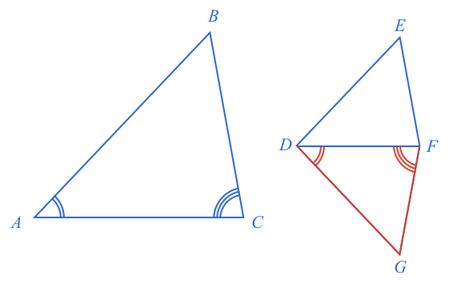
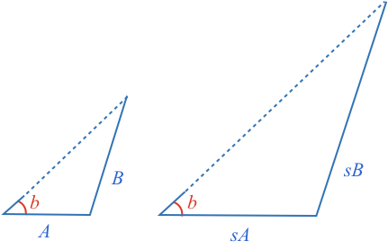
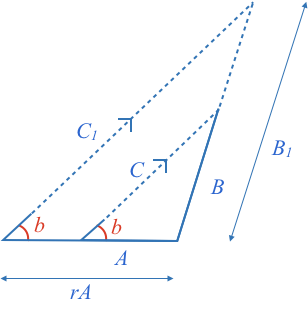

### Definition

**Similar** shapes are those that have the same shape but are a different size.

**Similar** triangles have the same corresponding angles and their corresponding sides are the same proportion.

### Triangles with Equal Corresponding Angles are Similar - Proof

Consider two triangles with **equal angles** overlaid on each other.

$$\definecolor{b}{RGB}\definecolor{r}{RGB}{238,34,12}{0,118,186}\angle DBC$$ and $$\angle ADE$$ are [[equal corresponding angles]]((qr,'Math/Geometry_1/AnglesAtIntersections/base/Corresponding',#00756F)), therefore $$\color{b}BC \parallel DE$$.

When a triangle is [[split with a parallel line]]((qr,'Math/Geometry_1/ParallelSplitOfTriangle/base/Triangle',#00756F)), the smaller triangle's sides will all be scaled by the same proportion.

Therefore $$\triangle ABC$$ and $$\triangle ADE$$ are **similar**.

*Triangles with the same corresponding angles will have corresponding sides of equal proportion, and will therefore be similar.*

### Similar Triangles have Equal Corresponding Angles - Proof

Start with two triangles whose **corresponding sides have equal proportion**.

Start by drawing the two proportional triangles $$\triangle ABC$$ and $$\triangle DEF$$, and then draw an additional triangle along $$DF$$ with the angles $$\angle BAC=\angle GDF$$ and $$\angle ACB=\angle DFG$$:

Angles in a triangle [[add]]((qr,'Math/Geometry_1/Triangles/base/AngleSum',#00756F)) to 180º, so two triangles with the same two angles will have the same third angle: $$\color{b}\angle ABC = \angle DGF$$

Therefore all the corresponding angles of $$\triangle ABC$$ and $$\triangle DFG$$ are equal.

From above, two triangles with the same corresponding angles are similar.

Therefore:

$$\color{b} \frac{DG}{AB} = \frac{DF}{AC} \ \ \ \ \ \ \ \ \color{grey}(1)$$

We started with:

$$\color{b} \frac{\color{r}{DE}\color{b}}{AB} = \frac{DF}{AC} \ \ \ \ \ \ \ \ \color{grey}(2)$$

Combining $$\color{grey}(1)$$ and $$\color{grey}(2)$$:

$$\color{b} DE = DG$$

Using the same process, can similarly show:

$$\color{b} EF = GF$$

Triangles with the same side lengths are [[congruent]]((qr,'Math/Geometry_1/CongruentTriangles/base/Sss',#00756F)), so the angles of $$\triangle DEF$$ will be equal to the angles in $$\triangle DFG$$ and therefore $$\triangle ABC$$.

Therefore $$\triangle ABC$$ and $$\triangle DEF$$ are similar as they have the same angles, and their corresponding sides have the same proportion.

### Similarity Tests

How many properties need to be identified to determine two triangles are similar?

As all similar triangles have equal corresponding angles, it follows that triangles without equal corresponding angles cannot be similar.

The longer [form of this explanation](/content/Math/Geometry_1/SimilarTriangles/explanation/static) shows all the combinations that are not possible and why. Here we will focus just on the ones that are.

### Angle-Angle-Angle (AAA) and Side-Side-Side (SSS)

By definition, if you know three angles, or three sides of two triangles, you can tell if they are similar or not by directly comparing their proportions.

### Angle-Angle (AA)

Two angles is also sufficient to determine similarity as all angles in a triangle [[add to 180º]]((qr,'Math/Geometry_1/Triangles/base/AngleSum',#00756F)), and therefore if you know two anlges you actually know all three.

### Side-Angle-Side (SAS)

If you know two triangles have the same angle surrounded by equal corresponding sides, then you can align the two triangles on top of each other.

* Align the two triangles by the known angle
* When two sides of a triangle [[are split in equal proportion]]((qr,'Math/Geometry_1/ParallelSplitOfTriangle/base/ProportionalSplit',#00756F)), the line between the splits is parallel to the remaining line.
* This means we have the case of a [[triangle split by a parallel line]]((qr,'Math/Geometry_1/ParallelSplitOfTriangle/base/Triangle',#00756F)), which results in a smaller proportional triangle
* Therefore the triangles are similar

### Side-Side-Angle (SSA)

For SSA, we know from [[SSA triangle congruency]]((qr,'Math/Geometry_1/CongruentTriangles/base/Ssa',#00756F)) that triangles are:

* Congruent when the opposite side is longer than or equal to the adjacent side
* Not congruent when the opposite side is shorter than the adjacent side

In other words, when the opposite side to the known angle is shorter than the adjacent side, more than one triangle can be created with different corresponding angles.

So, we can consider only the case where the opposite side is greater than or equal to the adjacent side.

Let's start by considering only the shorter triangle, and growing its base to be the same size as the larger triangle.

* Grow side $$\color{b}A$$ to length $$\color{b}rA$$, and put angle  $$\color{r}b$$ at its end
* Extend sides $$\color{b}B$$ and $$\color{b}C_1$$ to form a triangle
* The two $$\color{r}b$$ angles are [[equal corresponding angles]]((qr,'Math/Geometry_1/AnglesAtIntersections/base/Corresponding')) thus $$\color{b}C_1 \color{black}|| \color{b}C$$
* $$\color{b}\triangle rAB_1C_1$$ is therefore [[split with a parallel line]]((qr,'Math/Geometry_1/ParallelSplitOfTriangle/base/Triangle',#00756F))
* Therefore $$\color{b}\triangle rAB_1C_1$$ is similar to $$\color{b}\triangle ABC$$, and is scaled by $$\color{b}r$$
* Therefore $$\color{b}B_1\color{black}=\color{b}rB$$, $$\color{b}C_1\color{black}=\color{b}rC$$
* By [[SSA]]((qr,'Math/Geometry_1/CongruentTriangles/base/Ssa',#00756F)) the larger triangle is congruent with the original large triangle (as $$\color{b}rB\color{black}\gt\color{b}rA$$)
* Therefore the two original triangles are similar

The same method can be used for when $$\color{b}rB\color{black}=\color{b}rA$$.

