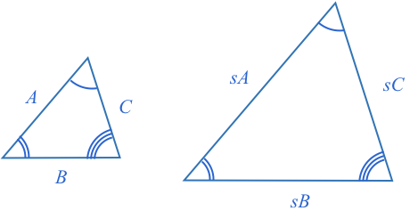

**Similar triangles** have corresponding sides that are proportional (have the same scaling factor, shown as $$\definecolor{b}{RGB}{0,118,186}\color{b}s$$ in the diagram).

All similar triangles have **equal corresponding angles**, and all triangles with equal corresponding angles angles are similar.'

