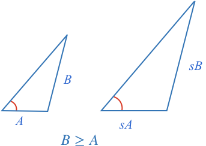

If any triangles have two corresponding sides that are proportional and share a corresponding equal angle adjacent to just one of the sides, then the triangles are only similar if the side **opposite the angle is greater than or equal to the adjacent side**. This is often called the **SSA** similarity test.
