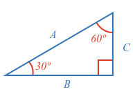
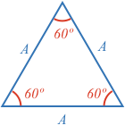
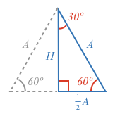
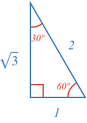

[[Similar triangles]]((qr,'Math/Geometry_1/SimilarTriangles/base/SimilarPres',#00756F)) are triangles that have the same shape, but may be a different size. In other words, their corresponding angles are equal, and their corresponding sides are all scaled by the same factor.

This means that all triangles with the same set of angles will have the same ratio between their sides. If one side is twice as long as another, then it will be the same in all similar triangles.

For some special triangles, it is possible to calculate these ratios geometrically.

Can you calculate the values of $$A$$, $$B$$ and $$C$$ for the right angle triangle with angles 30º and 60º?

<hint>Start with an equilateral triangle.</hint>

<hintLow>
Is there a 30º-60º-90º triangle within an equilateral triangle, and if so can you calculate its side lengths?

</hintLow>

<hintLow>
Remember the following:

* All angles in a triangle [[add to 180º]]((qr,'Math/Geometry_1/Triangles/base/AngleSum',#00756F)).
* [[SSS]]((qr,'Math/Geometry_1/CongruentTriangles/base/Sss',#00756F)), [[SAS]]((qr,'Math/Geometry_1/CongruentTriangles/base/Sas',#00756F)), [[Isosceles triangles]]((qr,'Math/Geometry_1/Isosceles/base/Main',#00756F)) and how it is [[split]]((qr,'Math/Geometry_1/Isosceles/base/SplitLine',#00756F)), and/or [[supplementary angles]]((qr,'Math/Geometry_1/AngleGroups/base/Supplementary',#00756F)) (you only need one or two of these depending on the path you take).
* [[Pythagorean Theorem]]((qr,'Math/Geometry_1/RightAngleTriangles/base/Pythagorus',#00756F)).
</hintLow>

<hintLow>[Answer]
Consider an equilateral triangle split such that one side is halved.

Each smaller triangle has the same corresponding side lengths, so by [[SSS]]((qr,'Math/Geometry_1/CongruentTriangles/base/Sss',#00756F)) they are the same (congruent). Note, you could also show they are congruent using [[SAS]]((qr,'Math/Geometry_1/CongruentTriangles/base/Sss',#00756F)), or knowing how an isosceles triangle splits[[isosceles triangle splits]]((qr,'Math/Geometry_1/Isosceles/base/SplitLine',#00756F)). As such:
* Their corresponding angles are equal
* The top angle must be half of 60º
* The bottom angle is [[supplementary]]((qr,'Math/Geometry_1/AngleGroups/base/Supplementary',#00756F)) and therefore must be 90º.

Use the [[Pythagorean Theorem]]((qr,'Math/Geometry_1/RightAngleTriangles/base/Pythagorus',#00756F)) to solve for |H|.

$$H^2 + \left(\frac{A}{2}\right)^2 = A^2$$

$$H^2 = A^2 - \frac{A^2}{4}$$

$$H^2 = \frac{3}{4}A^2$$

$$H = \frac{\sqrt{3}}{2}A$$

We now have:

To remove the fractions, we can multiply all sides by 2. Also, people often show the triangle substituting $$A = 1$$.

Any time you come accross a right angle triangle with a 30º or 60º angle, you will know the proportion of the sides is $$1$$, $$\sqrt3$$ and $$2$$.

</hintLow>

<!-- 

<hintLow>
Here are several triangles:

[[isosceles]]((qr,'Math/Geometry_1/Isosceles/base/Main',#00756F)) 

[Explanation](/content/Math/Geometry_1/SideAngleRelationship/explanation/base?page=23)

$$\definecolor{g}{RGB}{29,177,0}\definecolor{b}{RGB}{0,118,186}\definecolor{r}{RGB}{238,34,12}\definecolor{v}{RGB}{203,41,123}\defineColor{gr}{100,100,100}$$

</hintLow>

 -->