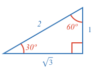
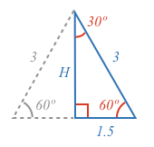
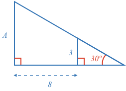

### Example 1

What are the lengths of sides A and B?

<hintLow>[Answer]
The triangle has three angles of 30º, 60º and 90º making it a 30-60-90 triangle.

A 30-60-90 triangle has the side length ratios of:

Therefore, if we know the side between the 90º and 60º angles is length 10, then:

$$A = 10 \times 2 = \bbox[10px,border:1px solid gray]{20}$$

$$B = 10 \times \sqrt{3} = \bbox[10px,border:1px solid gray]{17.32}$$
</hintLow>

### Example 2

What is the height of the equilateral triangle?

<hintLow>[Answer]
We need to know three things for this problem:

* An [[equilateral triangle]]((qr,'Math/Geometry_1/Equilateral/base/Main',#00756F)) has angles of 60º.
* An equilateral triangle is also an [[isosceles triangle]]((qr,'Math/Geometry_1/Isosceles/base/Main',#00756F)).
* The line that [[splits]]((qr,'Math/Geometry_1/Isosceles/base/SplitLine',#00756F)), an isosceles triangle in half, splits an angle in half, a side in half, and is at right angles to the side.

Therefore, if we split an equilateral triangle in half, we get two 30-60-90 triangles.

A 30-60-90 triangle has the following side ratios:

The height is along the ratio $$\sqrt{3}$$, and therefore is:

$$H = 1.5 \times \sqrt{3} = \bbox[10px,border:1px solid gray]{2.60}$$
</hintLow>

### Example 3

What is the area of this triangle?

<hintLow>[Answer]
To solve this problem we need to know:

1. A triangle's angles [[sum to 180º]]((qr,'Math/Geometry_1/Triangles/base/AngleSum',#00756F))
2. The [[area]]((qr,'Math/Geometry_1/RightAngleTriangles/base/Area',#00756F)) of a right angle triangle is half the product of its sides adjacent to the right angle.

Using (1), we know the third angle must be:

$$180^\circ - 90^\circ - 30^\circ = 60^\circ$$

Therefore this is a 30-60-90 triangle with ratios:

The length of the second side adjacent to the right angle is:

$$L = \frac{7}{\sqrt{3}} = 4.04$$

Therefore using (2) the area is:

$$Area = \frac{1}{2} \times 4.04 \times 7 =  \bbox[10px,border:1px solid gray]{14.14}$$
</hintLow>

### Example 4

What is the area of this triangle?

<hintLow>[Answer]

To solve this problem we need to know:

1. A triangle's angles [[sum to 180º]]((qr,'Math/Geometry_1/Triangles/base/AngleSum',#00756F))
2. Any triangle with two equal angles is an [[isosceles triangle]]((qr,'Math/Geometry_1/Isosceles/base/Main',#00756F)).
3. The line that [[splits]]((qr,'Math/Geometry_1/Isosceles/base/SplitLine',#00756F)), an isosceles triangle in half, splits an angle in half, a side in half, and is at right angles to the side.
4. The [[area]]((qr,'Math/Geometry_1/AreaTriangle/base/Main',#00756F)) of a triangle with half the product of its base and [[perpendicular]]((qr,'Math/Geometry_1/AngleTypes/base/Perpendicular',#00756F)) height.

Using (1) we know the third angle must be:

$$180^\circ - 30^\circ - 30^\circ = 120^\circ$$

Using (2) we recognize this is an equilateral triangle.

Using (3) we get:

Each triangle half is a 30-60-90 triangle with ratios:

Therefore, the height must be:

$$\frac{\frac{10}{2}}{\sqrt{3}} = 2.89$$

Therefore the area is:

$$Area = \frac{1}{2} \times 5 \times 2.89 =  \bbox[10px,border:1px solid gray]{7.23}$$
</hintLow>

### Example 5

What are the lengths of the sides of the quadrilateral?

<hintLow>[Answer]
To solve this problem we need to know:

1. A quadrangle or quadrilateral's internal angles [[sum to 360º]]((qr,'Math/Geometry_1/Quadrangles/base/Main',#00756F)).
2. Any quadrangle or quadrilateral with four right angles is a [[rectangle]]((qr,'Math/Geometry_1/RectanglesAndSquares/base/Rectangle',#00756F)).
3. A triangle's angles [[sum to 180º]]((qr,'Math/Geometry_1/Triangles/base/AngleSum',#00756F))

Using (1) we can calculate the fourth angle of the quadrilateral:

$$360^\circ - 90^\circ - 90^\circ - 90^\circ = 90^\circ$$

Therefore, from (2) as all four angles of the quadrilateral are 90º, it must be a rectangle. As a rectangle, the opposite sides are equal, therefore:

$$A = C$$

$$B = D$$

Looking at the triangle to the bottom right of the rectangle, its third angle from (3) is:

$$180^\circ - 90^\circ - 60^\circ = 30^\circ$$

And so we have:

The bottom right triangle is a 30-60-90 triangle with side ratios of:

Therefore sides A and B can be calculated from the diagonal:

$$A = \frac{8}{2} =  \bbox[10px,border:1px solid gray]{4}$$

$$B = \frac{8}{2} \times \sqrt{3} =  \bbox[10px,border:1px solid gray]{6.93}$$
</hintLow>

### Example 6

What is the length of side A?

<hintLow>[Answer]
To solve this problem we need to know:

1. A triangle's angles [[sum to 180º]]((qr,'Math/Geometry_1/Triangles/base/AngleSum',#00756F))

Using (1) we can calculate the two unknown triangle angles:

$$180^\circ - 90^\circ - 30^\circ = 60^\circ$$

We now have:

The smaller and larger triangle are both 30-60-90 triangles with side ratios of:

Therefore we can calculate B as:

$$B = 3 \times \sqrt{3} = 5.20$$

Therefore the total base length of the larger triangle is:

$$8 + 5.20 = 13.20$$

And from this and the 30-60-90 ratios we can calculate A:

$$A = \frac{13.20}{\sqrt{3}} =  \bbox[10px,border:1px solid gray]{7.62}$$
</hintLow>

<!-- 
What is the size of angle $$\definecolor{r}{RGB}{238,34,12}\bbox[10px,border:1px solid gray]{a}$$ in degrees?

<hintLow>[Answer]
[[triangle]]((qr,'Math/Geometry_1/Triangles/base/AngleSum',#00756F)) 
</hintLow>

 $$\bbox[10px,border:1px solid gray]{Yes}$$ -->